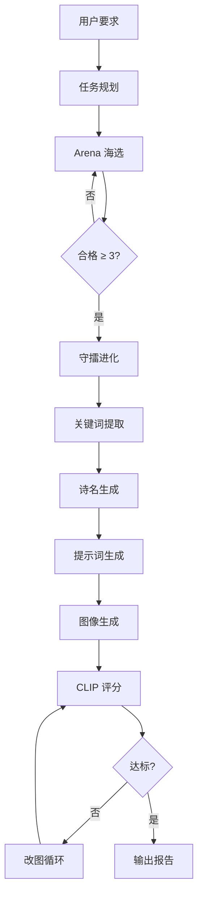

# InkVerse · 诗画墨语

**AI 古诗创作与水墨画生成系统** —— 本地 LoRA 生成格律诗 + Z-Image Turbo 文生图 + Pairwise 进化择优。消费级显卡可运行。

输入"写一首描写夏天的七言绝句，要有意向荷花"，系统从生成五首候选、硬门控筛选、擂台进化打磨到最终配图出稿，全程无需人工介入。

古诗生成使用本地 LoRA 微调模型（Qwen2.5-1.5B + LoRA，古典诗词数据集训练），图像生成使用本地 FP8 量化 Z-Image Turbo。两者分时加载，消费级 8GB 显存可运行。古诗评审、切题判断、诗名与提示词生成等语言任务调用 API（推荐阿里百炼 qwen 系列）——本地小模型在鉴赏类环节与大模型存在显著差距。

## 流程



### Arena 海选

LoRA 生成 5 首候选。不使用绝对评分排序，而是先过硬门控再做 pairwise 对决。

1. 硬门控：押韵、平仄、堆砌词黑名单、重度重复——纯本地规则，零成本拦截不合格的诗
2. 切题评估：一次 LLM 调用评判五首主题契合度，配合本地季节/昼夜/天气矛盾扫描
3. 本地评分：平仄、押韵、意象丰富度、主题连贯性、切题度，五项加权
4. 轮循 pairwise：Top3 两两对决，LLM 做比较判断
5. 综合：本地分 × 0.75 + pairwise 胜率 × 0.25

单轮合格不足 3 首时重新生成（最多 3 轮），累计合格池直到满足要求。

### 守擂进化

冠军成为擂主，每轮从不同维度生成 2 个挑战者。挑战者先过硬门控，再与擂主进行 1v1 pairwise 对决。综合本地客观分与 pairwise 微调决定是否易位。每轮基于上一轮最优版本继续打磨。

### 图像流水线

冠军诗定稿后：关键词提取 → 诗名生成 → 英文提示词 → 生图 → CLIP 双锚点评分（诗-图 + 提示词-图）→ 改图循环。改图时每轮从历史最优图出发，避免在改坏的图上继续改。自适应停止：连续两轮无显著提升则提前退出。

### 为什么是 pairwise

LLM 给单首诗打绝对分数波动极大——同一首诗两次调用可差 1 分，五首分数全部簇集在 7.5-9.0 区间，缺乏区分度。"这两首哪首更好"是 LLM 擅长的判断。系统所有需要 LLM 评估质量的环节均使用比较而非打分。

## 快速开始

### 环境

- Python 3.10+
- CUDA 12.4+
- 显存 ≥ 8GB（LoRA 与 Z-Image 分时加载，不共存）

### 模型下载

**基座模型 Qwen2.5-1.5B-Instruct**

```bash
hf download Qwen/Qwen2.5-1.5B-Instruct --local-dir D:\AI_Models\Qwen2.5-1.5B-Instruct
```

**古诗 LoRA 权重**

基于古典诗词数据集微调，数据集 [Judy-Liu118/poetry-lora](https://huggingface.co/datasets/Judy-Liu118/poetry-lora)。权重放入 `models/poetry_lora/`。古诗生成默认使用 LoRA，本地微调模型在格律规范性上优于通用 API。

**Z-Image Turbo FP8**

[ykarout/Z-Image-Turbo-FP8-Full](https://huggingface.co/ykarout/Z-Image-Turbo-FP8-Full)，基于 Tongyi-MAI/Z-Image-Turbo 的 FP8 量化版。

```bash
hf download ykarout/Z-Image-Turbo-FP8-Full --local-dir D:\AI_Models\z_image_fp8_full
```

**CLIP ViT-B/32**

```bash
hf download openai/clip-vit-base-patch32 --local-dir D:\AI_Models\clip-vit-base-patch32
```

### 安装与配置

```bash
git clone https://github.com/Judy-Liu118/InkVerse.git
cd InkVerse
pip install -r requirements.txt
```

项目根目录创建 `.env`：

```env
DASHSCOPE_API_KEY=sk-xxxxxxxx     # 阿里百炼（评分/提示词/图像 API）
```

编辑 `config.py` 中的模型路径：

```python
BASE_MODEL_PATH = r"D:\AI_Models\Qwen2.5-1.5B-Instruct"
LORA_PATH = "models/poetry_lora"
ZIMAGE_PATH = "D:/AI_Models/z_image_fp8_full"
CLIP_MODEL_PATH = r"D:\AI_Models\clip-vit-base-patch32"
```

无 API 时，将评分、诗名、提示词模型选为"本地"，图像后端选"本地 Z-Image"。

### 运行

```bash
python app.py
```

浏览器打开 `http://localhost:7860`。

## 界面说明

### 模型选择

| UI 标签 | 推荐模型 | 说明 |
|---------|---------|------|
| 诗歌生成模型 | Qwen2.5-1.5B + LoRA | 本地，格律规范性优于通用 API |
| 意图评分模型 | qwen-plus | API，覆盖切题评估、擂台 pairwise |
| 诗名生成模型 | qwen-plus | API |
| 提示词生成模型 | qwen-max | API，英文结构化 prompt 需要较强模型 |
| 图像后端 | z-image-turbo（百炼 API）/ 本地 Z-Image | API 更快、分辨率更高；本地无网络依赖 |
| 自主图像编辑模型 | qwen-image-edit-max | API，保留构图仅修改局部 |

无 API 时图像编辑自动降级为"改写重生图"模式——LLM 将意见融入 Prompt 后重新生图。图像 API 调用失败也会自动切本地 Z-Image。

### 图像风格

支持五种风格，通过下拉框选择。不同风格会注入对应的英文 prompt 前缀，影响生图效果：

- 水墨画：`Chinese ink wash painting, sumi-e, monochrome, minimalist, Song Dynasty style`
- 写意画：`xieyi freehand ink painting, expressive spontaneous brushwork, loose poetic strokes`
- 青绿山水：`Chinese blue-green landscape, qinglu style, mineral pigments, Tang Dynasty luminous`
- 油画、卡通插画

推荐使用水墨画或写意画，与中国古典诗主题最为契合。

### 按钮功能

| 按钮 | 说明 |
|------|------|
| 开始创作 | 逐步执行：生成候选 → 用户可中途改诗 → 配图。适合已知要写什么诗、需要逐步控制的场景 |
| 全自主创作 | 一键走完 Arena 海选 → 守擂进化 → 配图全流程。选好所有模型后直接点击 |
| 改诗 | 在"改诗意见"框输入修改方向，选择改诗模型。基于当前版本进行定向修改 |
| 仅重新生成图 | 若对当前 Prompt 不满意，直接修改 Prompt 文本框后点击，基于新 Prompt 重新生图 |
| 图像编辑 | 在"改图意见"框输入修改指令（如"增加月光感"），调用编辑 API 保留构图局部修改 |
| 改写重生图 | 在"改图意见"框输入意见，LLM 将意见融入 Prompt 后丢弃原图重新生成，适合大幅改动 |
| 生成报告 | 将当前诗文、图像、模型使用记录导出为 HTML 报告 |

**快速上手**：选好所有模型和风格 → 输入创作要求 → 点「全自主创作」。

**使用已有古诗**：将诗粘贴到"诗文"文本框 → 清空"创作要求" → 点「全自主创作」或「开始创作」。系统以你的诗为擂主直接进入进化打磨，然后配图。

## 使用示例

### 示例一：全自主生成

创作要求：*写一首描写夏天的七言绝句，要有意向荷花*

模型配置：诗歌生成 LoRA + 意图评分 qwen-plus + 诗名 qwen-plus + 提示词 qwen-max + 图像 z-image-turbo + 编辑 qwen-image-edit-max


第一轮改图后 CLIP 从 0.312 提升至 0.333，达标退出循环。改图指令为"增加竹荫下的曲径和池亭的细节描绘"。
改图前：


改图后：


### 示例二：回滚机制

创作要求：*写一首描写秋天的七言律诗，要有意向菊花*

第一轮改图 CLIP 从 0.302 退至 0.269——改动降低了图文一致性。系统回滚到初始图，第二轮从初始图出发继续改，而非在改坏的图上叠加修改。最终两轮未达目标，自动退回历史最优结果（0.302）。

原版得分0.302：


第一版修改，增加月光洒在鹤羽毛上的细节，增强幽静感。（保留原图构图，仅修改指令涉及内容），得分0.269低于原版：


第二版修改——由于第一版得分低于原版，系统回滚到原版图上重新修改，而非在第一版的残骸上继续。增强霜覆盖山岭的效果，突出秋意浓厚。（保留原图构图，仅修改指令涉及内容），得分0.291仍低于原版：


得分均低于原版，回退原版，最终效果：


### 示例三：输入已有诗 + 手动改图

创作要求：*以边塞为主题写一首七言绝句*

先用全自主生成一首边塞诗。若对某首诗更满意，将创作要求清空、诗文粘贴到文本框，点击「开始创作」。系统跳过生成环节，直接用这首诗生成图像。图为对原图不满意选原擂主诗点击开始创作生成：


对画面不满意时，在"改图意见"框输入具体修改指令：

- "在画面中加上将军，体现将军白发不胜簪"


- 发现给的意见太粗糙将军太大了，在此基础上进一步提出修改意见，"不要这么大的将军，将军小一些，背对着，可以坐在战马上"


每次点击「图像编辑」，系统基于当前图像按指令局部修改。

最终修改后和修改前图片对比：


### 示例四：生成诗和图后点击生成报告


## 目录结构

```
InkVerse/
├── app.py                  # Gradio UI
├── config.py               # 全局配置
├── core/
│   ├── agent/
│   │   ├── agent.py        # 创作引擎
│   │   ├── autonomous.py   # 全自主模式调度
│   │   ├── state.py        # 状态与追踪
│   │   └── tools.py        # 工具抽象层
│   ├── poem/
│   │   ├── generator.py    # 古诗生成 + Arena 海选
│   │   ├── scorer.py       # 评分 + pairwise + 切题评估
│   │   └── theme.py        # 意象与情感主题词表
│   ├── image/
│   │   ├── generator.py    # 图像生成双后端
│   │   ├── prompt.py       # 提示词生成器
│   │   └── api.py          # 百炼 API 客户端
│   ├── models/
│   │   ├── adapter.py      # 统一模型适配层
│   │   └── manager.py      # 显存管理
│   ├── evaluation/
│   │   └── clip.py         # CLIP 评分器
│   └── logger.py
├── models/                 # LoRA 权重
├── outputs/                # 生成的图像与报告
└── fonts/
```

## 依赖

- `torch` + `transformers` — 本地模型推理与 CLIP
- `unsloth` + `peft` — Qwen2.5 4-bit LoRA 加载
- `diffusers` — Z-Image Turbo FP8 扩散模型
- `openai` — 阿里百炼 API
- `pypinyin` + `pingshui_rhyme` — 平仄标注与平水韵部
- `gradio` — Web UI

## License

MIT
