# InkVerse · 诗画墨语

**AI 古诗创作与水墨画生成系统** —— 本地 LoRA 生成格律诗 + Z-Image Turbo 文生图 + Pairwise 进化择优。消费级显卡可运行。

输入"写一首描写夏天的七言绝句，要有意向荷花"，系统从生成五首候选、硬门控筛选、擂台进化打磨到最终配图出稿，全程无需人工介入。

古诗生成使用本地 LoRA 微调模型（Qwen2.5-1.5B + LoRA，古典诗词数据集训练），图像生成使用本地 FP8 量化 Z-Image Turbo。两者分时加载，消费级 8GB 显存可运行。古诗评审、切题判断、诗名与提示词生成等语言任务调用 API（推荐阿里百炼 qwen 系列）——本地小模型在鉴赏类环节与大模型存在显著差距。

## 流程

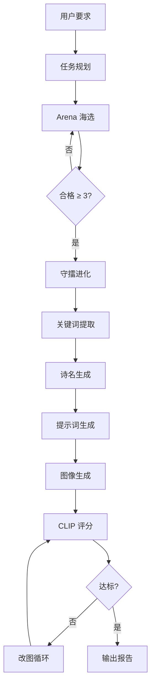

### Arena 海选

LoRA 生成 5 首候选。不使用绝对评分排序，而是先过硬门控再做 pairwise 对决。

1. 硬门控：押韵、平仄、堆砌词黑名单、重度重复——纯本地规则，零成本拦截不合格的诗
2. 切题评估：一次 LLM 调用评判五首主题契合度，配合本地季节/昼夜/天气矛盾扫描
3. 本地评分：平仄、押韵、意象丰富度、主题连贯性、切题度，五项加权
4. 轮循 pairwise：Top3 两两对决，LLM 做比较判断
5. 综合：本地分 × 0.75 + pairwise 胜率 × 0.25

单轮合格不足 3 首时重新生成（最多 3 轮），累计合格池直到满足要求。

### 守擂进化

冠军成为擂主，每轮从不同维度生成 2 个挑战者。挑战者先过硬门控，再与擂主进行 1v1 pairwise 对决。综合本地客观分与 pairwise 微调决定是否易位。每轮基于上一轮最优版本继续打磨。

### 图像流水线

冠军诗定稿后：关键词提取 → 诗名生成 → 英文提示词 → 生图 → CLIP 双锚点评分（诗-图 + 提示词-图）→ 改图循环。改图时每轮从历史最优图出发，避免在改坏的图上继续改。自适应停止：连续两轮无显著提升则提前退出。

### 为什么是 pairwise

LLM 给单首诗打绝对分数波动极大——同一首诗两次调用可差 1 分，五首分数全部簇集在 7.5-9.0 区间，缺乏区分度。"这两首哪首更好"是 LLM 擅长的判断。系统所有需要 LLM 评估质量的环节均使用比较而非打分。

## 快速开始

### 环境

- Python 3.10+
- CUDA 12.4+
- 显存 ≥ 8GB（LoRA 与 Z-Image 分时加载，不共存）

### 模型下载

**基座模型 Qwen2.5-1.5B-Instruct**

```bash
hf download Qwen/Qwen2.5-1.5B-Instruct --local-dir D:\AI_Models\Qwen2.5-1.5B-Instruct
```

**古诗 LoRA 权重**

基于古典诗词数据集微调，数据集 [Judy-Liu118/poetry-lora](https://huggingface.co/datasets/Judy-Liu118/poetry-lora)。权重放入 `models/poetry_lora/`。古诗生成默认使用 LoRA，本地微调模型在格律规范性上优于通用 API。

**Z-Image Turbo FP8**

[ykarout/Z-Image-Turbo-FP8-Full](https://huggingface.co/ykarout/Z-Image-Turbo-FP8-Full)，基于 Tongyi-MAI/Z-Image-Turbo 的 FP8 量化版。

```bash
hf download ykarout/Z-Image-Turbo-FP8-Full --local-dir D:\AI_Models\z_image_fp8_full
```

**CLIP ViT-B/32**

```bash
hf download openai/clip-vit-base-patch32 --local-dir D:\AI_Models\clip-vit-base-patch32
```

### 安装与配置

```bash
git clone https://github.com/Judy-Liu118/InkVerse.git
cd InkVerse
pip install -r requirements.txt
cp .env.example .env          # 仅 Windows PowerShell：Copy-Item .env.example .env
```

编辑 `.env` 填入需要的 Key 和（可选）本地模型路径：

```env
# 必填
DASHSCOPE_API_KEY=sk-xxxxxxxx     # 阿里百炼（评分/提示词/图像 API）

# 可选 —— 不填则启动时自动隐藏对应「本地」选项，仅保留 API 后端
# BASE_MODEL_PATH=D:\AI_Models\Qwen2.5-1.5B-Instruct
# LORA_PATH=./models/poetry_lora
# ZIMAGE_PATH=D:\AI_Models\z_image_fp8_full
```

**纯 API 模式**：跳过模型下载、只配 `DASHSCOPE_API_KEY` 即可运行；UI 会自动只显示百炼 API 后端选项。

**本地 + API 混合模式**：填入三条本地路径，UI 同时显示本地 LoRA / Z-Image 与 API 后端，按需切换。

启动 banner 会打印每项资源的可用性，方便确认当前在哪种模式下运行：

```
本地 LLM 基座:     可用 / 未启用（API 模式）
本地 LoRA Adapter: 可用 / 未启用
本地 Z-Image:     可用 / 未启用（百炼 API 模式）
```

### 运行

```bash
python app.py
```

浏览器打开 `http://localhost:7860`。

## 界面说明

### 模型选择

| UI 标签 | 推荐模型 | 说明 |
|---------|---------|------|
| 诗歌生成模型 | Qwen2.5-1.5B + LoRA | 本地，格律规范性优于通用 API |
| 意图评分模型 | qwen-plus | API，覆盖切题评估、擂台 pairwise |
| 诗名生成模型 | qwen-plus | API |
| 提示词生成模型 | qwen-max | API，英文结构化 prompt 需要较强模型 |
| 图像后端 | z-image-turbo（百炼 API）/ 本地 Z-Image | API 更快、分辨率更高；本地无网络依赖 |
| 自主图像编辑模型 | qwen-image-edit-max | API，保留构图仅修改局部 |

无 API 时图像编辑自动降级为"改写重生图"模式——LLM 将意见融入 Prompt 后重新生图。图像 API 调用失败也会自动切本地 Z-Image。

### 图像风格

支持五种风格，通过下拉框选择。不同风格会注入对应的英文 prompt 前缀，影响生图效果：

- 水墨画：`Chinese ink wash painting, sumi-e, monochrome, minimalist, Song Dynasty style`
- 写意画：`xieyi freehand ink painting, expressive spontaneous brushwork, loose poetic strokes`
- 青绿山水：`Chinese blue-green landscape, qinglu style, mineral pigments, Tang Dynasty luminous`
- 油画、卡通插画

推荐使用水墨画或写意画，与中国古典诗主题最为契合。

### 按钮功能

| 按钮 | 说明 |
|------|------|
| 开始创作 | 逐步执行：生成候选 → 用户可中途改诗 → 配图。适合已知要写什么诗、需要逐步控制的场景 |
| 全自主创作 | 一键走完 Arena 海选 → 守擂进化 → 配图全流程。选好所有模型后直接点击 |
| 改诗 | 在"改诗意见"框输入修改方向，选择改诗模型。基于当前版本进行定向修改 |
| 仅重新生成图 | 若对当前 Prompt 不满意，直接修改 Prompt 文本框后点击，基于新 Prompt 重新生图 |
| 图像编辑 | 在"改图意见"框输入修改指令（如"增加月光感"），调用编辑 API 保留构图局部修改 |
| 改写重生图 | 在"改图意见"框输入意见，LLM 将意见融入 Prompt 后丢弃原图重新生成，适合大幅改动 |
| 生成报告 | 将当前诗文、图像、模型使用记录导出为 HTML 报告 |

**快速上手**：选好所有模型和风格 → 输入创作要求 → 点「全自主创作」。

**使用已有古诗**：将诗粘贴到"诗文"文本框 → 清空"创作要求" → 点「全自主创作」或「开始创作」。系统以你的诗为擂主直接进入进化打磨，然后配图。

## 使用示例

### 示例一：全自主生成

创作要求：*写一首描写夏天的七言绝句，要有意向荷花*

模型配置：诗歌生成 LoRA + 意图评分 qwen-plus + 诗名 qwen-plus + 提示词 qwen-max + 图像 z-image-turbo + 编辑 qwen-image-edit-max
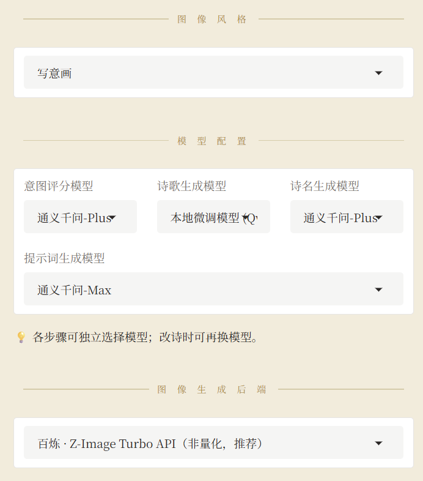
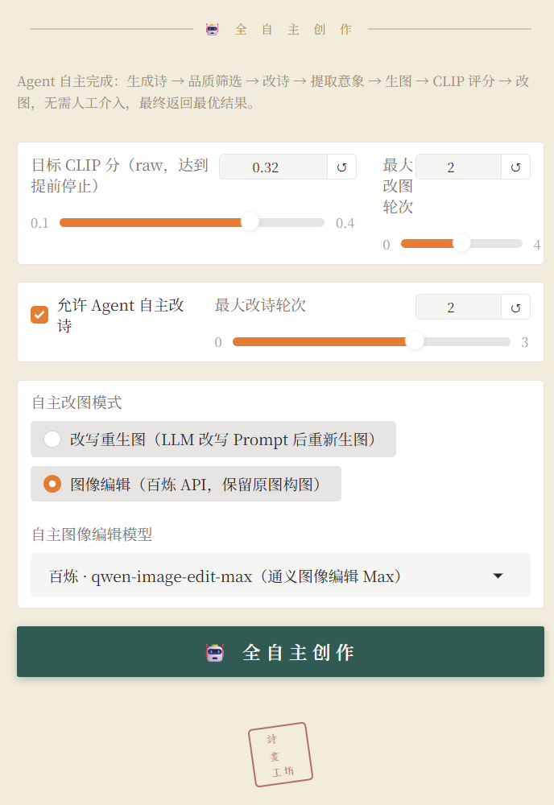

第一轮改图后 CLIP 从 0.312 提升至 0.333，达标退出循环。改图指令为"增加竹荫下的曲径和池亭的细节描绘"。
改图前：
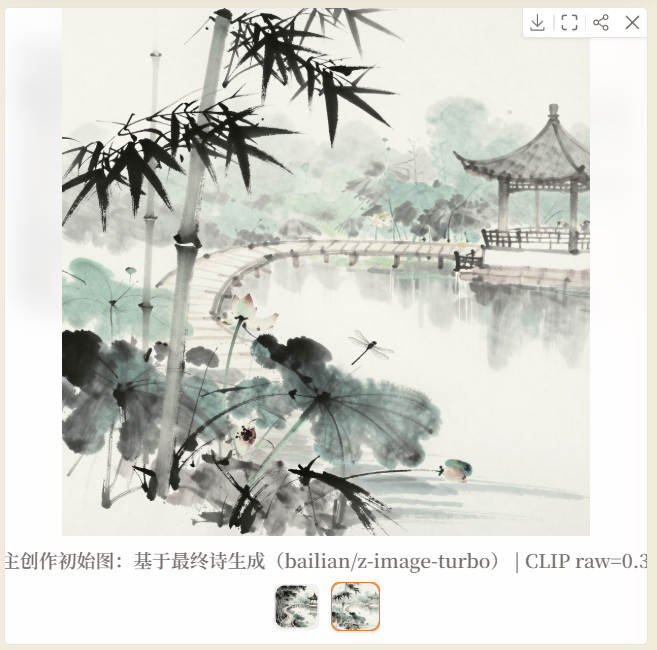

改图后：
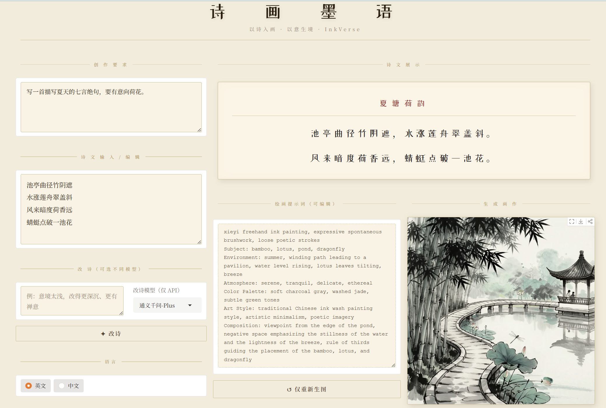

### 示例二：回滚机制

创作要求：*写一首描写秋天的七言律诗，要有意向菊花*

第一轮改图 CLIP 从 0.302 退至 0.269——改动降低了图文一致性。系统回滚到初始图，第二轮从初始图出发继续改，而非在改坏的图上叠加修改。最终两轮未达目标，自动退回历史最优结果（0.302）。

原版得分0.302：
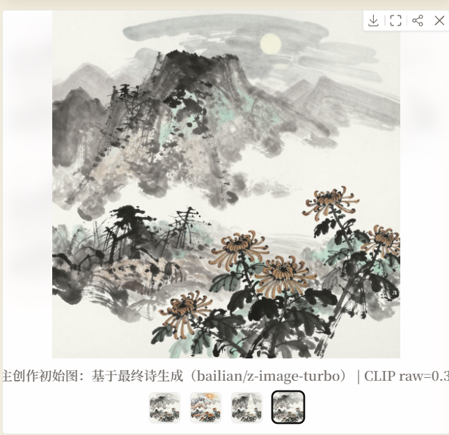

第一版修改，增加月光洒在鹤羽毛上的细节，增强幽静感。（保留原图构图，仅修改指令涉及内容），得分0.269低于原版：
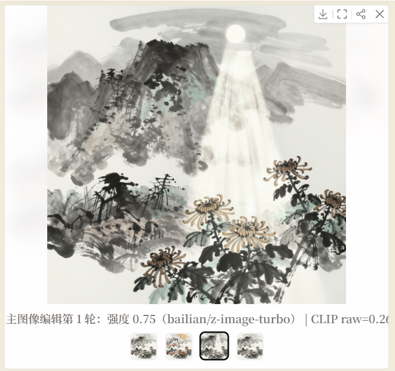

第二版修改——由于第一版得分低于原版，系统回滚到原版图上重新修改，而非在第一版的残骸上继续。增强霜覆盖山岭的效果，突出秋意浓厚。（保留原图构图，仅修改指令涉及内容），得分0.291仍低于原版：
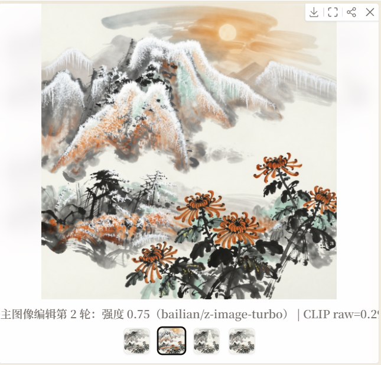

得分均低于原版，回退原版，最终效果：
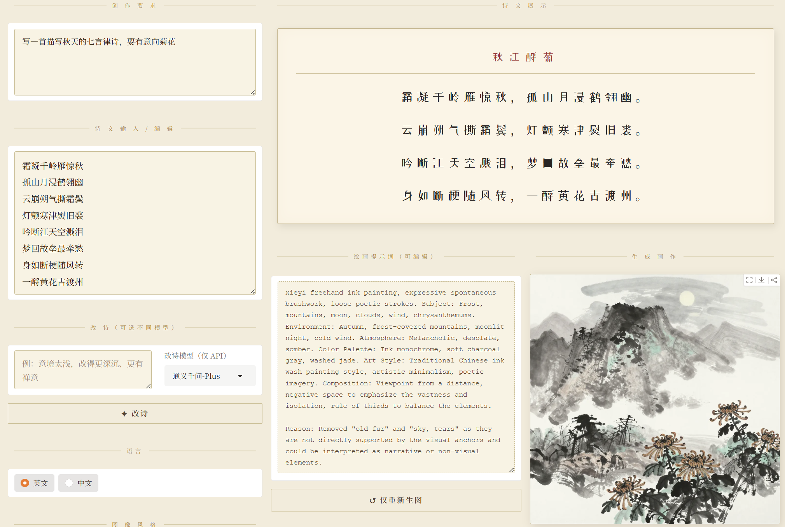

### 示例三：输入已有诗 + 手动改图

创作要求：*以边塞为主题写一首七言绝句*

先用全自主生成一首边塞诗。若对某首诗更满意，将创作要求清空、诗文粘贴到文本框，点击「开始创作」。系统跳过生成环节，直接用这首诗生成图像。图为对原图不满意选原擂主诗点击开始创作生成：

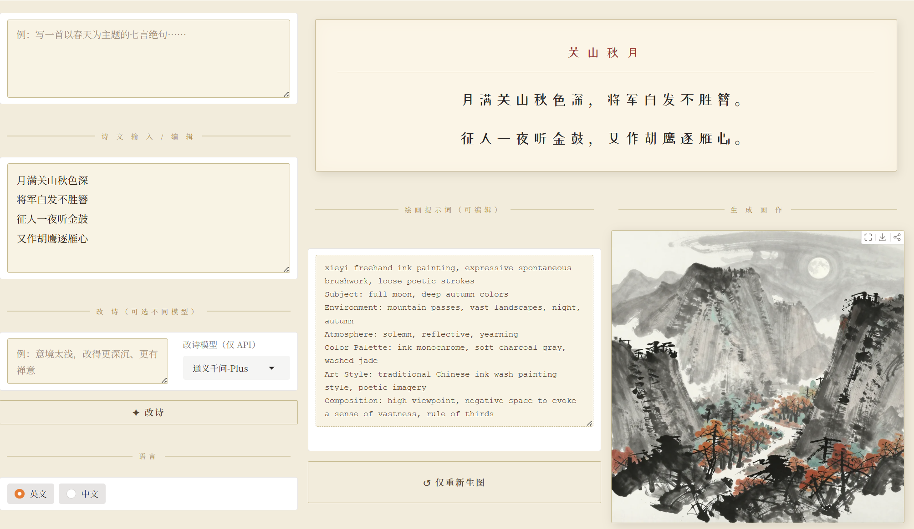

对画面不满意时，在"改图意见"框输入具体修改指令：

- "在画面中加上将军，体现将军白发不胜簪"
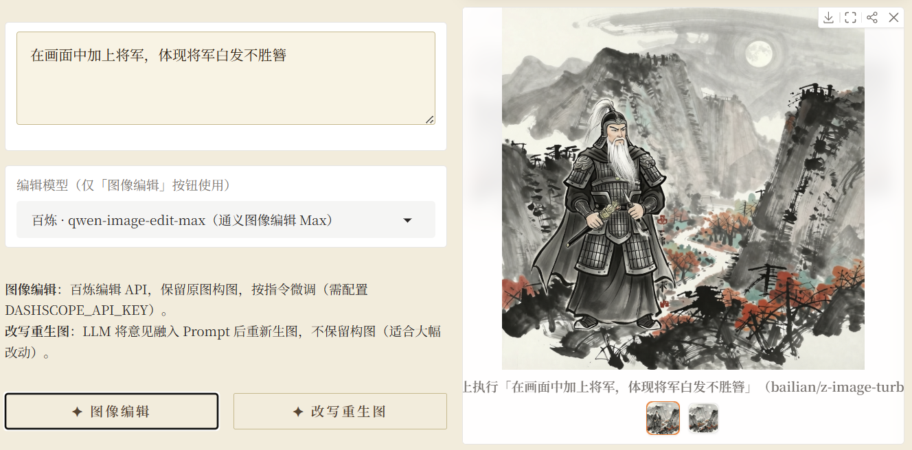

- 发现给的意见太粗糙将军太大了，在此基础上进一步提出修改意见，"不要这么大的将军，将军小一些，背对着，可以坐在战马上"
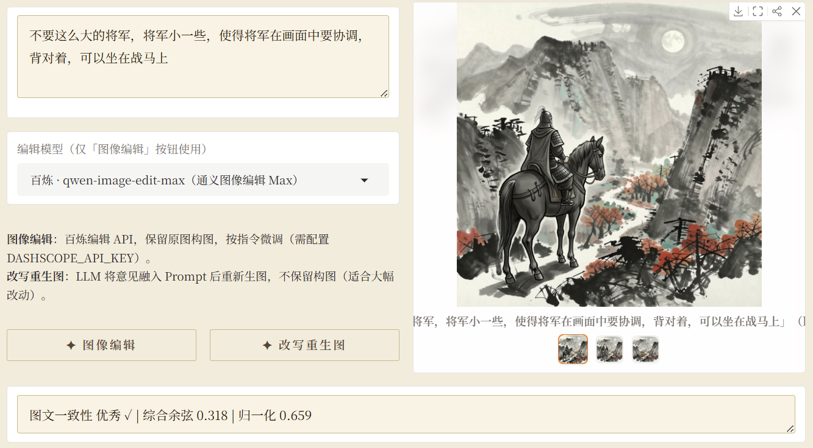

每次点击「图像编辑」，系统基于当前图像按指令局部修改。

最终修改后和修改前图片对比：
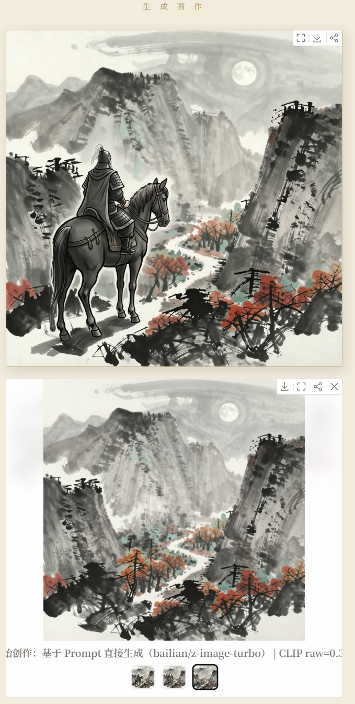

### 示例四：生成诗和图后点击生成报告
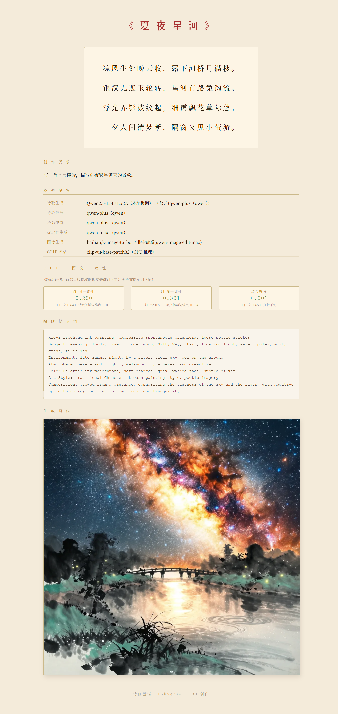

## 目录结构

```
InkVerse/
├── app.py                  # Gradio UI
├── config.py               # 全局配置 + 本地模型路径可用性探测
├── core/
│   ├── agent/
│   │   ├── agent.py        # 创作引擎（PoetryAgent，_phase_* 主流水线）
│   │   ├── autonomous.py   # 全自主模式调度
│   │   ├── state.py        # 状态与追踪
│   │   └── tools.py        # Tool 抽象 + ToolRegistry（Function Calling 兼容）
│   ├── poem/
│   │   ├── generator.py    # 古诗生成 + Arena 海选
│   │   ├── scorer.py       # 评分 + pairwise + 切题评估
│   │   └── theme.py        # 意象与情感主题词表
│   ├── image/
│   │   ├── generator.py    # 图像生成双后端
│   │   ├── prompt.py       # 提示词生成器
│   │   └── api.py          # 百炼 API 客户端
│   ├── models/
│   │   ├── adapter.py      # 统一模型适配层（local/deepseek/qwen）
│   │   └── manager.py      # 显存管理（重型依赖延迟加载）
│   ├── evaluation/
│   │   └── clip.py         # CLIP 评分器
│   └── logger.py
├── prompts/                # 集中化 prompt YAML（含 README 与版本号）
├── tests/                  # pytest 单测（adapter/state/scorer/tools/clip/prompts）
├── models/                 # LoRA 权重
├── outputs/                # 生成的图像与报告
└── fonts/
```

## Prompt 集中管理

所有 LLM system / user prompt 抽离到 `prompts/` 目录，以 YAML 形式管理，由 `core.prompts` 模块统一加载渲染：

```python
from core.prompts import render_messages

messages = render_messages(
    "agent.refine_poem",
    expected_chars=7, expected_lines=4,
    old_poem="...", feedback="加强意境深度",
)
```

- **可审阅**：git diff 时 prompt 变更不被代码改动淹没
- **可枚举**：`list_prompts()` 一键列出全部 prompt，便于审计与 A/B 测试
- **可追踪**：每个 YAML 自带 `version` + `description`，配合 git 即天然版本管理
- **fail-fast**：缺变量直接抛 `KeyError`，避免静默生成残缺 prompt

详见 [`prompts/README.md`](prompts/README.md)。

## Tool 抽象与可调度性

`core.agent.tools` 提供了一套 OpenAI Function Calling 兼容的工具层，把 `PoetryAgent` 的每个创作阶段（规划/生成/抽取意象/命名/提示词/自检/生图/反思/改诗/改图）封装成可枚举、可 introspection 的 Tool。每个 Tool 既可被业务代码直接调用，也可通过 `to_function_schemas()` 导出为 LLM tools 描述，用于未来对接 MCP、Agent 服务化或外部调度。

```python
from core.agent import PoetryAgent

agent = PoetryAgent(...)
reg = agent.tool_registry
print(reg.names)
# ['plan', 'generate_poem', 'extract_visual_keywords', 'generate_title',
#  'generate_image_prompt', 'review_image_prompt', 'generate_image',
#  'reflect', 'refine_poem', 'edit_image']

schemas = reg.to_function_schemas()    # 可直接喂给 OpenAI tools=[...]
state = reg.execute("plan", state)      # 按名调度
```

`PoetryAgent` 内部仍以 `_phase_*` 方法实现业务，Tool 层只做轻量 facade —— 避免维护两套实现。

## 离线评估

`eval/` 目录提供 4 个独立可跑的评估脚本，用于量化项目里的核心设计点：

```bash
# 1. 诗歌生成模型质量对比（BWS + 跨家族多评委 pairwise，支持 --repeat 多 run）
python -m eval.eval_poem --models local_lora qwen-plus \
    --scorer qwen-max glm-4-plus --n 10

# 2. 双锚点 CLIP vs 单锚点（项目核心创新；含 VLM ground truth）
python -m eval.eval_clip --n 10

# 3. 自动方向性诗评 + refine_poem 的提升幅度
python -m eval.eval_refine --n 10

# 4. 全自主模式 vs 单轮模式 CLIP 终值 + 耗时对比
python -m eval.eval_autonomous --n 5
```

完整方法论（公式 / 系数 / 评委 prompt / 阈值）见 [`eval/METHODOLOGY.md`](eval/METHODOLOGY.md) —— 该文档冻结当前 commit 的实验方法，保证后续代码漂移仍能解释历史报告。

每次跑完会在 `outputs/eval/` 下落两份产物：
- `<name>_<timestamp>.json` —— 原始数据，便于二次分析
- `<name>_<timestamp>.md`   —— markdown 报告，含均值/std/配对差值/胜率/抽样对照，可直接抄进实验章节

详见 [`eval/README.md`](eval/README.md)（含 benchmark 数据集说明、参数约定、结果解读建议）。

### 代表性发现 · n=32 × 3 run 主跑

`eval_poem --models local_base local_lora local_lora_naked qwen-plus --scorer deepseek-v4-pro qwen-max glm-4-plus moonshot-v1-32k --n 32 --candidates 5 --repeat 3`

跨 4 LLM 评委（跨家族抗 self-bias）+ 3 run（暴露 LLM noise，主要指标 std 0.005-0.03 → 结论 reproducible）。

**1. LoRA 把格律内化进权重 —— 移掉 system prompt 反而更好**

| 指标 | LoRA full | **LoRA naked** | Δ |
|---|---|---|---|
| 平仄合格率 (≥0.8) | 95.4% ± 4.3% | **96.4% ± 3.0%** | +1.0pp |
| 押韵合格率 (≥0.8) | 32.9% ± 6.2% | **39.0% ± 1.8%** | +6.1pp |

naked 模式仅传简短 user request，不带任何格式约束。微调的格律合规来自权重本身，而非 in-context 引导。

**2. LoRA 提升地板，不提升天花板**

| 指标 | local_base | local_lora | Δ |
|---|---|---|---|
| pass@0.7 候选合格率 | 36.2% ± 2.6% | **64.0% ± 2.4%** | +27.8pp（≈ ×1.8）|
| best 候选 4 维 total | 0.771 ± 0.012 | 0.771 ± 0.004 | 0 |

候选池合格率几乎翻倍，best 候选评分持平。LoRA 收紧分布、砍坏样本 —— alignment fine-tune 的典型 pattern。

**3. LLM-as-judge 对格律不敏感**

| 模型 | 平仄合格率 | pairwise 胜率 |
|---|---|---|
| local_base | **25.6%** ± 6.4% | 0.356 ± 0.044 |
| local_lora | 95.4% ± 4.3% | 0.312 ± 0.025 |
| local_lora_naked | 96.4% ± 3.0% | 0.319 ± 0.028 |

base 平仄只有 LoRA 的 1/4，pairwise 胜率反而最高。4 评委判断里格律权重接近 0，主要看 intent/imagery/aesthetics —— 生产里做格律保证必须保留 rule-based scorer 作为硬约束，不能完全替换成 LLM judge。

**方法论亮点：** 跨家族 4 评委集成（DeepSeek + Qwen + GLM + Moonshot）抗 self-bias · forward+reverse 双向 pairwise 暴露 position bias（摇摆率 23% 公开标注）· BWS 选 best 规避评分饱和 · 3 run mean ± std 区分信号 vs 噪声 · 评委解析失败显式弃权不污染 multi-judge 合成。

完整报告：`outputs/eval/eval_poem_<timestamp>.md` · 32 道分层 benchmark 见 [`eval/benchmark_themes.json`](eval/benchmark_themes.json)。

## 测试

```bash
pytest tests/ -v
# 35 passed in ~6s
```

覆盖：
- `test_adapter.py` —— ModelAdapter 后端选择、env-var 回退、key 优先级
- `test_state.py` —— AgentState 默认值、trace 追踪、序列化往返、Phase 枚举稳定性
- `test_scorer.py` —— 平仄/押韵评分边界、合掌词库、堆砌词黑名单
- `test_clip_weights.py` —— CLIP 双锚点稀疏关键词自适应权重切换
- `test_tools.py` —— ToolRegistry 注册/查找/调度、Function Calling schema 形状
- `test_prompts.py` —— prompt YAML 解析、变量插值、缺变量 fail-fast、loader 缓存

## 依赖

**核心（API 模式必装）**
- `gradio` — Web UI
- `openai` — 阿里百炼 / DeepSeek API（OpenAI 兼容）
- `pypinyin` + `pingshui_rhyme` — 平仄标注与平水韵部
- `Pillow`、`requests`

**CLIP 评分（推荐安装）**
- `torch` + `transformers` — CLIP 图文一致性评分

**本地后端（可选）**
- `unsloth` + `peft` + `bitsandbytes` — Qwen2.5 4-bit LoRA 加载
- `diffusers` + `xformers` — Z-Image Turbo FP8 扩散模型

未安装可选依赖时，相关本地选项会在 UI 中自动隐藏，应用照常运行。

## License

MIT
