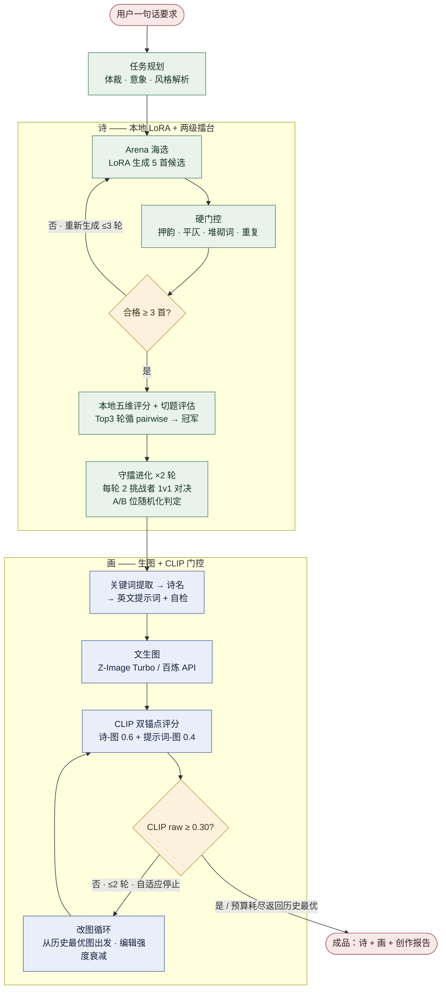

# InkVerse · 诗画墨语

[](https://github.com/Judy-Liu118/InkVerse/actions/workflows/tests.yml)

**AI 古诗创作与水墨画生成系统** —— 本地 LoRA 生成格律诗 + Z-Image Turbo 文生图 + Pairwise 进化择优。

项目有两条并列的工程线。**一是把整条创作流水线压进消费级 8GB 显存**：本地 LoRA 与 FP8 量化 Z-Image Turbo 不共存显存，配合重型依赖延迟加载，单张 8GB 消费级显卡即可完成诗与画的本地生成。**二是在没有客观真值的领域做可信评估**：诗写得好不好、画与诗贴不贴合都没有标准答案，能用的裁判只有同样不可靠的 LLM 与 VLM，因此重点在**如何从不可靠的裁判里构造出可信的质量判断**——跨家族多评委抗 self-bias、position bias 的审计与随机化防御、多次独立重复区分信号与噪声、量化管线噪声地板作为判读下限。

生成侧的每个设计判断都由这套评估回路检验，包括被判定为数据不支持、因而在生产中默认关闭的那一个。

https://github.com/user-attachments/assets/e3e16375-3ff4-4977-93b6-f8fb514dbccd

<p align="center"><sub>全自主创作实录（12.5 倍速，实际 4 分半）——「写一首描写夏景的七言律诗，要有意向荷花和蜻蜓」：LoRA 生成候选 → 硬门控与擂台择优 → 提示词生成与自检 → 生图 → CLIP 0.309 未达目标 → LLM 决策改图 1 轮 → 0.319 达标停止。<a href="docs/images/hero-run-full.jpeg">完整页面截图（含 Agent 思考轨迹全文）</a></sub></p>

古诗生成使用本地 LoRA 微调模型（Qwen2.5-1.5B + LoRA，古典诗词数据集训练），图像生成使用本地 FP8 量化 Z-Image Turbo，两者分时加载。古诗评审、切题判断、诗名与提示词生成等语言任务调用 API（推荐阿里百炼 qwen 系列）——本地小模型在鉴赏类环节与大模型存在显著差距。

## 三分钟导览

按阅读目的快速定位：

| 关注点 | 对应内容 |
|---|---|
| 评估方法与严谨性 | [离线评估](#离线评估)：5 个可复跑脚本 · 10 份入库报告 · 方法论冻结文档 |
| 结论可信度 | 实验规则于运行前预登记至脚本 docstring 并 commit（[示例](eval/eval_llm_loop_ab.py)）· 原始数据 / 终端全量镜像 / 逐轮图证均已入库（`eval/runs/`）· [192 个离线测试](#测试) |
| 作品质量 | 下方[作品示例](#作品示例)（6 组诗与配图，均为评估 run 真实产物，未经人工筛改）· A/B 实验逐轮改图图库 [run 1](eval/runs/llm_loop_ab/gallery/GALLERY.md) / [run 2](eval/runs/llm_loop_ab_run2/gallery/GALLERY.md) |
| 系统架构与流程 | [流程图](#流程)（两级诗歌擂台 + CLIP 门控改图循环）· [目录结构](#目录结构) |

三条工作主线及其代表性结果：

- **微调**：LoRA 将候选合格率提升 1.8 倍（36%→64%）而 best 候选评分持平——提升地板而非天花板；移除格式 prompt 后格律合规率未退化（96%），表明规则已内化进权重（上游数据清洗与训练记录见 [docs/LORA_TRAINING.md](docs/LORA_TRAINING.md)）
- **评估**：跨家族 4 评委 pairwise 对抗 self-bias；position-bias 审计经历「发现显著 → 自我证伪 → 方向反转 → 随机化防御落地」的完整闭环
- **agent**：预登记的同基图配对 A/B（n=27 × 2 次独立运行）显示 LLM-driven 改图循环与固定流程循环 CLIP 终值持平、效率占优；replication 撤回了首轮 2 个不稳定观察，并量化出管线噪声约为臂间效应的 7 倍——**基于该数据，此特性在生产环境默认关闭**

## 作品示例

以下六组均为评估 run 的真实产物（终稿诗 + CLIP 择优终图），**未经人工挑改字句**。带 † 的两首出自消融实验的「无擂台」对照臂，一次生成直达此质量；其余四首为带擂台的全流程产物。六首诗均由本地 LoRA（Qwen2.5-1.5B + LoRA）生成；配图模型为百炼 `qwen-image-2.0-pro`（《客愁》《春雨江钓》用 2026-03-03 快照，其余四首用 2026-04-22 快照）。

第一排是 sparse 抽象主题（只给主题词，不点名意象），看意境经营：

| 「写一首七言律诗，<br>主题是客愁」 | 「写一首五言绝句，<br>主题是溪声」 | 「写一首七言绝句，<br>主题是春雨」 |
|---|---|---|
|  |  |  |
| **《客愁》**<br>风翻墨浪客衣单<br>霜凝石径暮烟寒<br>雁衔夕照千峰瘦<br>雨织灯痕一水残<br>孤棹摇波星欲堕<br>半窗移竹影初攒<br>归期暗数芦花雪<br>故国遥看月浸滩 | **《溪声》**<br>微飔穿竹径<br>清响落云间<br>松影摇溪浅<br>苔痕浸水闲 | **《春雨江钓》**<br>江头春雨濯云屏<br>风飐垂杨绿欲停<br>偶倚沙痕听鹭语<br>一蓑烟水钓波青 |

第二排是 rich 题，看**点名意象的兑现**——用户点名的意象须在诗与画中同时出现，三首均经 VLM 硬约束核查 2/2 命中：

| 「写一首送别的七言律诗，<br>要有长亭和折柳」† | 「写一首禅意的七言绝句，<br>要有古刹和钟鼓」† | 「写一首田园的七言绝句，<br>要有耕牛和炊烟」 |
|---|---|---|
|  |  |  |
| **《离亭折柳》**<br>江头酒力已微醺<br>一别相逢几许春<br>风递梅花知远近<br>水含明月见相亲<br>青门路断无多雨<br>白发人归少有尘<br>欲向离亭折杨柳<br>可怜无力更伤神 | **《古刹钟声》**<br>古刹钟声夜未休<br>松间野鹤伴云游<br>人间岁月如流水<br>更向何时得少留 | **《春村耕趣》**<br>村路风清雨过稀<br>春来无事亦忘机<br>耕牛未肯还田去<br>犹把新泥护柳枝 |

右例《春村耕趣》是消融报告中「擂台把丢失的用户约束补回来」的直接证据主题：无擂台臂两个约束全丢，擂台臂 2/2 命中。逐题三方对比见 [sweep 报告](eval/REPORT_pairwise_win_delta_sweep_2026-06-30.md) §3，擂台有无的双图并排见[消融报告](eval/REPORT_arena_ablation_20260701.md) §4.1。

## 流程


```mermaid
flowchart TD
    A(["用户一句话要求"]) --> B["任务规划<br>体裁 · 意象 · 风格解析"]

    subgraph P ["诗 —— 本地 LoRA + 两级擂台"]
        C["Arena 海选<br>LoRA 生成 5 首候选"] --> D["硬门控<br>押韵 · 平仄 · 堆砌词 · 重复"]
        D --> E{"合格 ≥ 3 首?"}
        E -- "否 · 重新生成 ≤3 轮" --> C
        E -- "是" --> F["本地五维评分 + 切题评估<br>Top3 轮循 pairwise → 冠军"]
        F --> G["守擂进化 ×2 轮<br>每轮 2 挑战者 1v1 对决<br>A/B 位随机化判定"]
    end
    B --> C

    subgraph I ["画 —— 生图 + CLIP 门控"]
        H["关键词提取 → 诗名<br>→ 英文提示词 + 自检"] --> J["文生图<br>Z-Image Turbo / 百炼 API"]
        J --> K["CLIP 双锚点评分<br>诗-图 0.6 + 提示词-图 0.4"]
        K --> L{"CLIP raw ≥ 0.30?"}
        L -- "否 · ≤2 轮 · 自适应停止" --> M["改图循环<br>从历史最优图出发 · 编辑强度衰减"]
        M --> K
    end
    G --> H
    L -- "是 / 预算耗尽返回历史最优" --> Z(["成品：诗 + 画 + 创作报告"])

    classDef poem fill:#e9f3ec,stroke:#41805e,color:#173324
    classDef img  fill:#e9eef8,stroke:#4a63a8,color:#16213f
    classDef gate fill:#fbf1dd,stroke:#c2913a,color:#43350f
    classDef ends fill:#f7e9e9,stroke:#a25454,color:#3c1c1c
    class B,C,D,F,G poem
    class H,J,K,M img
    class E,L gate
    class A,Z ends
```

### 两级擂台

LoRA 生成 5 首候选，不做绝对评分排序，而是先过硬门控再 pairwise 对决：

1. 硬门控：押韵、平仄、堆砌词黑名单、重度重复——纯本地规则，零成本拦截不合格的诗
2. 切题评估：一次 LLM 调用评判五首主题契合度，配合本地季节 / 昼夜 / 天气矛盾扫描
3. 本地五维评分：平仄、押韵、意象丰富度、主题连贯性、切题度加权
4. Top3 轮循 pairwise，综合 = 本地分 × 0.75 + pairwise 胜率 × 0.25

单轮合格不足 3 首时重新生成（≤3 轮），累计合格池直到满足要求。冠军成为擂主，随后 2 轮每轮从不同维度生成 2 个挑战者，挑战者先过硬门控再与擂主 1v1 pairwise（A/B 位随机化），综合本地客观分决定是否易位。

### 图像流水线

关键词提取 → 诗名 → 英文提示词 → 生图 → CLIP 双锚点评分（诗-图 + 提示词-图）→ 改图循环。改图时每轮从历史最优图出发，避免在改坏的图上继续改；连续两轮无显著提升则提前退出，预算耗尽返回历史最优。

### 为什么是 pairwise

LLM 给单首诗打绝对分数波动极大——同一首诗两次调用可差 1 分，五首分数簇集在 7.5-9.0 区间，缺乏区分度。「这两首哪首更好」则是 LLM 擅长的判断。系统所有需要 LLM 评估质量的环节均使用比较而非打分。

## 离线评估

`eval/` 提供 5 个独立可跑的评估脚本，用于量化项目里的核心设计点：

| 脚本 | 测什么 |
|---|---|
| `eval_poem` | 诗歌生成模型质量对比（BWS + 跨家族多评委 pairwise，`--repeat` 支持多 run） |
| `eval_clip` | 双锚点 CLIP vs 单锚点（项目核心创新；含 VLM ground truth） |
| `eval_refine` | 自动方向性诗评 + `refine_poem` 的提升幅度 |
| `eval_autonomous` | 全自主模式 vs 单轮模式的 CLIP 终值与耗时 |
| `eval_llm_loop_ab` | LLM-driven vs 固定流程改图循环（同基图配对 A/B，预登记 + 配额熔断 + 全程审计记录） |

```bash
python -m eval.eval_poem --models local_lora qwen-plus --scorer qwen-max glm-4-plus --n 10
python -m eval.eval_llm_loop_ab --limit 1     # 冒烟；全量去掉 --limit
```

参数约定、benchmark 数据集与结果解读见 [`eval/README.md`](eval/README.md)。完整方法论（公式 / 系数 / 评委 prompt / 阈值）冻结在 [`eval/METHODOLOGY.md`](eval/METHODOLOGY.md)——该文档锁定当前 commit 的实验方法，保证后续代码漂移仍能解释历史报告。每次跑完在 `outputs/eval/` 落一份 JSON 原始数据与一份 markdown 报告（均值 / std / 配对差值 / 胜率 / 抽样对照）。

### 代表性发现 · n=32 × 3 run 主跑

`eval_poem --models local_base local_lora local_lora_naked qwen-plus --scorer deepseek-v4-pro qwen-max glm-4-plus moonshot-v1-32k --n 32 --candidates 5 --repeat 3`

跨 4 LLM 评委（跨家族抗 self-bias）+ 3 run（暴露 LLM noise）。**效应幅度逐条对照噪声地板**：合格率提升 +27.8pp ≫ std 0.024–0.026（稳固）；格律一条的 Δ 落在 std 内，仅支持「未退化」不支持「更优」；pairwise 胜率是波动最大的指标（`local_base` std 0.044），三条结论均不依赖其绝对值。

**1. LoRA 把格律内化进权重 —— 移掉 system prompt 也不退化**

| 指标 | LoRA full | LoRA naked | Δ |
|---|---|---|---|
| 平仄合格率 (≥0.8) | 95.4% ± 4.3% | 96.4% ± 3.0% | +1.0pp |
| 押韵合格率 (≥0.8) | 32.9% ± 6.2% | 39.0% ± 1.8% | +6.1pp |

naked 模式仅传简短 user request，不带任何格式约束。**两项 Δ 均落在各自 std 内，不构成 naked 优于 full 的证据**；结论依据的是「移除 in-context 引导后格律没有塌」——若格律靠 prompt 维持，此处应出现显著退化。

**2. LoRA 提升地板，不提升天花板**

| 指标 | local_base | local_lora | Δ |
|---|---|---|---|
| pass@0.7 候选合格率 | 36.2% ± 2.6% | **64.0% ± 2.4%** | +27.8pp（≈ ×1.8）|
| best 候选 4 维 total | 0.771 ± 0.012 | 0.771 ± 0.004 | 0 |

候选池合格率几乎翻倍，best 候选评分持平——LoRA 收紧分布、砍掉坏样本，alignment fine-tune 的典型 pattern。

**3. LLM-as-judge 对格律给「低优先级」权重（n 较小，初步推测）**

| 模型 | 平仄合格率 | pairwise 胜率 |
|---|---|---|
| local_base | **25.6%** ± 6.4% | 0.356 ± 0.044 |
| local_lora | 95.4% ± 4.3% | 0.312 ± 0.025 |
| local_lora_naked | 96.4% ± 3.0% | 0.319 ± 0.028 |

间接证据：base 平仄只有 LoRA 的 1/4，pairwise 胜率反而最高。Retrospective controlled pair 验证（[REPORT_F3](eval/REPORT_F3_pingze_sensitivity_20260624.md)）：n=4 个「base 严重出律 (pingze 25-38%) 但意境维度 ≥ lora」的对决里，**base 胜率 87.5%** —— 意境维度只领先 ~0.1 就翻盘了极端格律差距。反向（lora 格律反差，n=5）→ lora 全败，说明评委并非不在意格律。

**修正表述（n=4-5 较小，属初步推测）：** 评委对格律给低优先级权重，意境维度有 ≥0.1 优势即可覆盖极端格律差距；生产里做格律保证仍必须保留 rule-based scorer 做硬约束，不能替换为 LLM judge。强结论需独立的 64-pair 重跑验证。

**方法论亮点：** 跨家族 4 评委集成（DeepSeek + Qwen + GLM + Moonshot）抗 self-bias · forward+reverse 双向 pairwise 暴露 position bias（摇摆率 23% 公开标注）· BWS 选 best 规避评分饱和 · 3 run mean ± std 区分信号 vs 噪声 · 评委解析失败显式弃权不污染 multi-judge 合成。

**评估反哺生产：** eval 侧的 position-bias 方法论反过来审计了生产擂台——发现 judge 固定「擂主 A 位 / 挑战者 B 位」布局后做双向重判探针，复盘中识别出探针自身的选择-复现混杂并主动降级结论，最终落地 A/B 位随机化防御；后续两个无混杂探针给出方向相反的信号，恰好验证了「随机化不赌方向」的设计选择（严谨版：[sweep 报告 §6.3](eval/REPORT_pairwise_win_delta_sweep_2026-06-30.md) · 通俗版故事线：[METHODOLOGY §7.5](eval/METHODOLOGY.md)）。

完整报告：`outputs/eval/eval_poem_<timestamp>.md` · 32 道分层 benchmark 见 [`eval/benchmark_themes.json`](eval/benchmark_themes.json)。

### 代表性发现 · LLM-driven 改图循环 vs 固定流程循环（同基图配对，n=27 × 2 次独立运行）

27 题（硬约束题集全集，零挑题）共享同一基图后 `_copy_state` 分叉两臂：**固定臂**每轮按预设流程调用 edit API，**LLM 臂**由 controller 每轮自选 `edit_image(rewrite_regen|edit_api)` / `refine_poem_and_regen` / `stop`（经 `ToolRegistry` 真实调度），两臂同预算（3 轮、target raw=0.30）。实验规则于运行前预登记至脚本 docstring 并 commit；QuotaMeter 施加模型白名单断言与预算硬熔断；每题落盘诗歌分项得分、逐轮中间图、决策埋点与终端全量镜像。**全量运行完成后，按预登记执行同条件独立重复（run 2），检验 run-to-run 稳定性。**

| 指标（循环子集） | run 1 | run 2 | 判读 |
|---|---|---|---|
| LLM − 固定 mean Δ CLIP raw | +0.004 | −0.004 | **持平结论复现**（符号翻转，幅度为噪声量级） |
| 平均循环耗时（固定 / LLM） | 433s / 263s | 240s / 195s | LLM 更快的方向复现，幅度不稳定 |
| 图像 API 调用（固定 / LLM） | 36 / 30 | 23 / 22 | LLM 略少，两次一致 |
| controller fallback / 改诗 / 主动 stop | 0 / 0 / 0 | 0 / 0 / 0 | 行为特征稳定 |

**两次独立运行支持的结论：**

1. 在该窄循环内，LLM-driven 控制**未带来 CLIP 终值优势（持平结论在两次运行中均成立）**，但以更少调用、更短耗时达到相当结果——效率差异源于「达标即停」等可解释机制
2. run 1 观察到的两个初步信号（LLM 臂达标更多、edit_api 的「选择效应」）**被 run 2 证伪并撤回**——体现独立重复实验的必要性
3. 噪声地板量化：同题同管线独立重跑，基图 CLIP 波动（mean |Δ|=0.029）约为**臂间效应的 7 倍**——单次运行中 ≤0.01 量级的差异不具备判读价值
4. VLM 硬约束兑现率的臂间差异不可判读：像素完全相同的两张图在 temperature=0 下仍被 qwen-vl-max 给出不同判定（测量噪声不小于臂间差异）

此前的 n=5 先导实验（[REPORT_autonomous_n5](eval/REPORT_autonomous_n5_20260627.md)）曾给出「LLM 臂效果更差且耗时约 3 倍」的负面信号；本实验通过配额隔离（消除 API 失败时静默降级本地模型的污染）与同基图配对（消除前半段管线噪声）两项改进后，方向由负转平——两个混杂因子的识别与消除过程本身即是结论的组成部分。

**基于该数据，LLM-driven 路径在生产中默认关闭**：产品 UI 中可勾选启用（`app.py`「🤖 全自主创作」区域的「LLM 驱动改图循环（实验）」复选框），默认沿用原固定流程循环，保持向后兼容。

完整报告：[run 1](eval/REPORT_llm_loop_ab_n27_20260710.md) · [run 2 稳定性对照](eval/REPORT_llm_loop_ab_run2_20260711.md)；直观图库（诗 + 基图 + 逐轮改图 + 两臂终图并排）：[run 1](eval/runs/llm_loop_ab/gallery/GALLERY.md) · [run 2](eval/runs/llm_loop_ab_run2/gallery/GALLERY.md)；原始数据 + 终端全量镜像日志在 `eval/runs/llm_loop_ab*/`。

## 快速开始

环境要求：Python 3.10+ · CUDA 12.4+ · 显存 ≥ 8GB（LoRA 与 Z-Image 分时加载，不共存）。

```bash
git clone https://github.com/Judy-Liu118/InkVerse.git
cd InkVerse
pip install -r requirements.txt
cp .env.example .env      # 填入 DASHSCOPE_API_KEY
python app.py             # 浏览器打开 http://localhost:7860
```

纯 API 模式可跳过全部模型下载，只配 `DASHSCOPE_API_KEY` 即可运行，UI 会自动隐藏本地后端选项。四个模型的下载命令、`.env` 全部字段与依赖清单见 [docs/SETUP.md](docs/SETUP.md)；界面各控件与逐步操作说明见 [docs/USAGE.md](docs/USAGE.md)。

## 使用示例

### 改图循环：改坏了就回滚

创作要求：*写一首描写秋天的七言律诗，要有意向菊花*

第一轮改图（增加月光洒在鹤羽毛上的细节）CLIP 从 0.302 退至 0.269——改动降低了图文一致性。第二轮系统**回滚到原版图**重新出发（增强霜覆山岭），而非在改坏的图上叠加修改，得 0.291 仍低于原版。两轮均未超过原版，自动退回历史最优结果（0.302）。

| 原版（0.302） | 第一次修改（0.269 ↓） | 第二次修改（0.291 ↓） |
|---|---|---|
|  |  |  |

退回原版后的最终效果：


同一门控在另一题（*写一首描写夏天的七言绝句，要有意向荷花*）上给出相反的裁决：第一轮改图指令「增加竹荫下的曲径和池亭的细节描绘」使 CLIP 从 0.312 升至 0.333，达标退出循环。

| 改图前（0.312） | 改图后（0.333） |
|---|---|
|  |  |

### 人工介入路径

界面允许在任意一步接管：粘贴已有诗直接进入配图，或对成图逐轮下达定向修改指令。以一首边塞诗为例，两轮改图指令为「在画面中加上将军，体现将军白发不胜簪」→「不要这么大的将军，将军小一些，背对着，可以坐在战马上」：

| 加将军 | 调小并背身骑马 |
|---|---|
|  |  |

最终修改前后对比：


完整界面走查（含逐步截图、报告导出）见 [docs/USAGE.md](docs/USAGE.md)。

## 目录结构

```
InkVerse/
├── app.py                  # Gradio UI
├── config.py               # 全局配置 + 本地模型路径可用性探测
├── core/
│   ├── agent/
│   │   ├── agent.py        # 创作引擎（PoetryAgent，_phase_* 主流水线）
│   │   ├── autonomous.py   # 全自主模式调度
│   │   ├── state.py        # 状态与追踪
│   │   └── tools.py        # Tool 抽象 + ToolRegistry（Function Calling 兼容）
│   ├── poem/
│   │   ├── generator.py    # 古诗生成 + Arena 海选
│   │   ├── scorer.py       # 评分 + pairwise + 切题评估
│   │   └── theme.py        # 意象与情感主题词表
│   ├── image/
│   │   ├── generator.py    # 图像生成双后端
│   │   ├── prompt.py       # 提示词生成器
│   │   └── api.py          # 百炼 API 客户端
│   ├── models/
│   │   ├── adapter.py      # 统一模型适配层（local/deepseek/qwen）
│   │   └── manager.py      # 显存管理（重型依赖延迟加载）
│   ├── evaluation/
│   │   └── clip.py         # CLIP 评分器
│   └── logger.py
├── prompts/                # 集中化 prompt YAML（含 README 与版本号）
├── tests/                  # pytest 单测（adapter/state/scorer/tools/clip/prompts）
├── models/                 # LoRA 权重
├── outputs/                # 生成的图像与报告
└── fonts/
```

## Prompt 集中管理

所有 LLM system / user prompt 抽离到 `prompts/` 目录以 YAML 管理，由 `core.prompts.render_messages` 统一加载渲染：git diff 时 prompt 变更不被代码改动淹没；`list_prompts()` 可一键枚举全部 prompt，便于审计与 A/B 测试；每个 YAML 自带 `version` + `description`，配合 git 即天然版本管理；缺变量直接抛 `KeyError`，避免静默生成残缺 prompt。详见 [`prompts/README.md`](prompts/README.md)。

## Tool 抽象与可调度性

`core.agent.tools` 提供 OpenAI Function Calling 兼容的工具基类（`AgentTool`）与注册表（`ToolRegistry`）：工具可枚举、可 introspection，`to_function_schemas()` 直接导出 LLM tools 描述。生产中真实使用它的是 LLM-driven 改图循环（`core.agent.controller`）：`build_loop_registry` 注册 `edit_image` / `refine_poem_and_regen` 两个工具，controller 把工具 schema 注入决策 prompt，LLM 返回的 JSON 决策经 `ToolRegistry.execute` 按名真实调度。

早期版本曾把全部 10 个 `_phase_*` 阶段都包成 Tool，但除上述两个外生产从未调度过，已删除——只保留被真实使用的抽象。

## 测试

```bash
pytest tests/ -v
# 192 passed in ~8s（全部离线，不触发真实 LLM / 图像 API）
```

覆盖 ModelAdapter 后端选择与 env-var 回退、AgentState 序列化往返与 Phase 枚举稳定性、平仄/押韵评分边界与合掌及堆砌词库、CLIP 双锚点稀疏关键词自适应权重切换、ToolRegistry 调度与 Function Calling schema 形状、prompt YAML 解析与缺变量 fail-fast、改图循环 controller 的 JSON 兜底与非法工具 fallback、eval 指标数值正确性、VLM ground-truth judge 解析与错误兜底、F3 controlled pair 筛选边界防回归、擂台 pairwise A/B 位随机化的位置分配与弃权透传。详见 `tests/`。

## License

MIT
