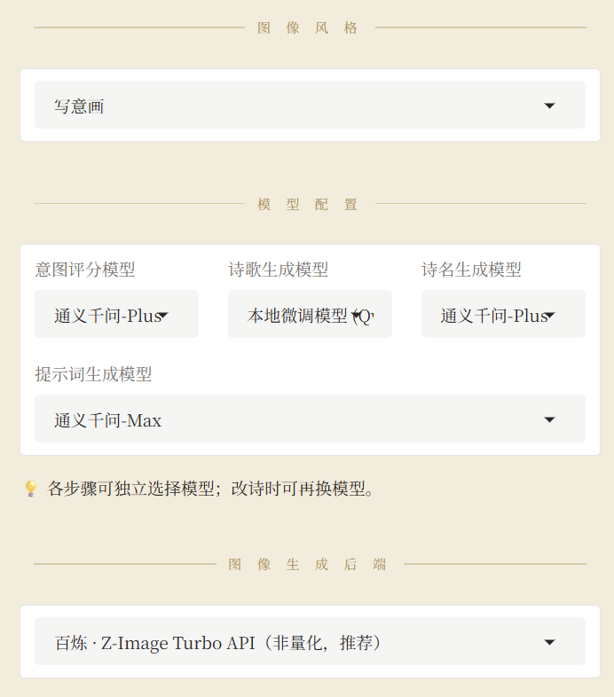
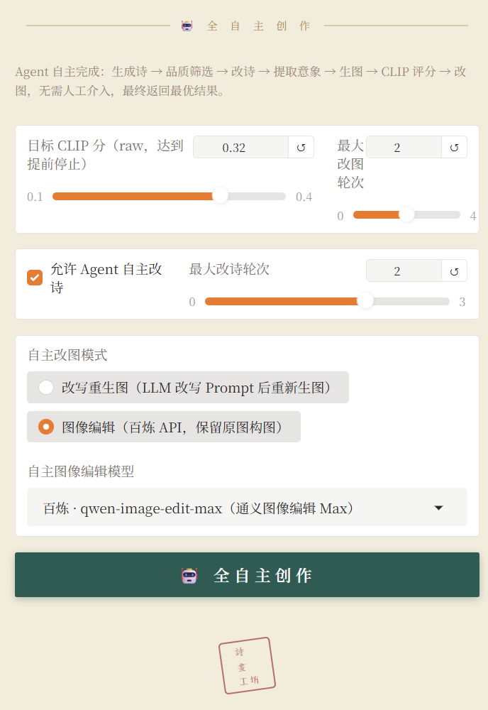
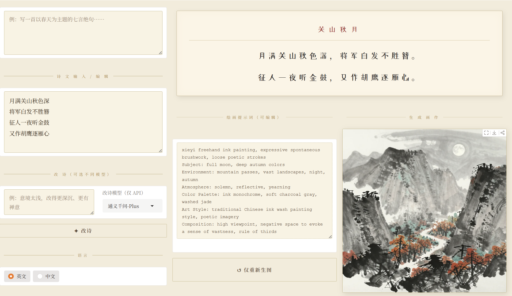
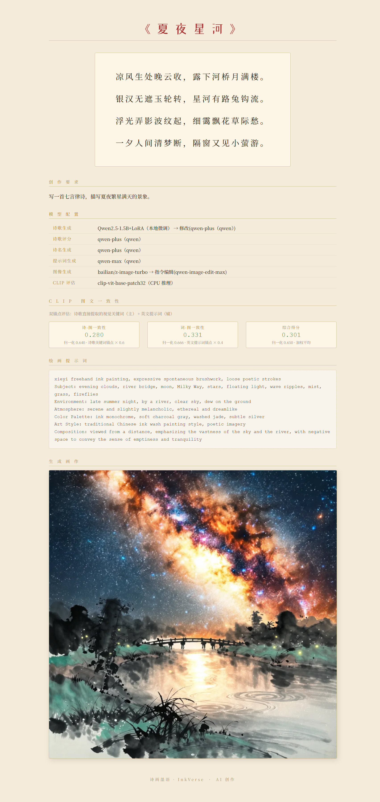

# 界面与操作说明

面向使用者的操作文档。系统设计与评估方法见 [README](../README.md)。

## 模型选择

| UI 标签 | 推荐模型 | 说明 |
|---------|---------|------|
| 诗歌生成模型 | Qwen2.5-1.5B + LoRA | 本地，格律规范性优于通用 API |
| 意图评分模型 | qwen-plus | API，覆盖切题评估、擂台 pairwise |
| 诗名生成模型 | qwen-plus | API |
| 提示词生成模型 | qwen-max | API，英文结构化 prompt 需要较强模型 |
| 图像后端 | z-image-turbo（百炼 API）/ 本地 Z-Image | API 更快、分辨率更高；本地无网络依赖 |
| 自主图像编辑模型 | qwen-image-edit-max | API，保留构图仅修改局部 |

无 API 时图像编辑自动降级为「改写重生图」模式——LLM 将意见融入 Prompt 后重新生图。图像 API 调用失败也会自动切本地 Z-Image。

## 图像风格

支持五种风格，通过下拉框选择。不同风格会注入对应的英文 prompt 前缀，影响生图效果：

- 水墨画：`Chinese ink wash painting, sumi-e, monochrome, minimalist, Song Dynasty style`
- 写意画：`xieyi freehand ink painting, expressive spontaneous brushwork, loose poetic strokes`
- 青绿山水：`Chinese blue-green landscape, qinglu style, mineral pigments, Tang Dynasty luminous`
- 油画、卡通插画

推荐使用水墨画或写意画，与中国古典诗主题最为契合。

## 按钮功能

| 按钮 | 说明 |
|------|------|
| 开始创作 | 逐步执行：生成候选 → 用户可中途改诗 → 配图。适合已知要写什么诗、需要逐步控制的场景 |
| 全自主创作 | 一键走完 Arena 海选 → 守擂进化 → 配图全流程。选好所有模型后直接点击 |
| 改诗 | 在「改诗意见」框输入修改方向，选择改诗模型。基于当前版本进行定向修改 |
| 仅重新生成图 | 若对当前 Prompt 不满意，直接修改 Prompt 文本框后点击，基于新 Prompt 重新生图 |
| 图像编辑 | 在「改图意见」框输入修改指令（如「增加月光感」），调用编辑 API 保留构图局部修改 |
| 改写重生图 | 在「改图意见」框输入意见，LLM 将意见融入 Prompt 后丢弃原图重新生成，适合大幅改动 |
| 生成报告 | 将当前诗文、图像、模型使用记录导出为 HTML 报告 |

**快速上手**：选好所有模型和风格 → 输入创作要求 → 点「全自主创作」。

**使用已有古诗**：将诗粘贴到「诗文」文本框 → 清空「创作要求」→ 点「全自主创作」或「开始创作」。系统以你的诗为擂主直接进入进化打磨，然后配图。

## 走查一：全自主创作的界面

创作要求：*写一首描写夏天的七言绝句，要有意向荷花*

模型配置：诗歌生成 LoRA + 意图评分 qwen-plus + 诗名 qwen-plus + 提示词 qwen-max + 图像 z-image-turbo + 编辑 qwen-image-edit-max。

| 全自主创作·初始 | 评分详情 |
|---|---|
|  |  |

这一轮的改图效果（CLIP 0.312 → 0.333）见 [README · 使用示例](../README.md#使用示例)。

## 走查二：输入已有诗 + 手动逐轮改图

创作要求：*以边塞为主题写一首七言绝句*

先用全自主生成一首边塞诗。若对某首诗更满意，将创作要求清空、诗文粘贴到文本框，点击「开始创作」。系统跳过生成环节，直接用这首诗生成图像。下图为对原图不满意、选原擂主诗点击「开始创作」后的界面：

对画面不满意时，在「改图意见」框输入具体修改指令，每次点击「图像编辑」，系统基于当前图像按指令局部修改：

1. 「在画面中加上将军，体现将军白发不胜簪」
2. 发现意见太粗糙、将军太大，在此基础上追加：「不要这么大的将军，将军小一些，背对着，可以坐在战马上」

两轮的生成图与最终前后对比见 [README · 使用示例](../README.md#使用示例)。

## 走查三：生成报告

生成诗和图后点击「生成报告」，导出 HTML：

