# 实验 B 图库 · 诗 → 基图 → 逐轮改图 → 两臂终图（n=27）

缩略图（480px）供直观对比；原图 1024px 存本地 `images/`（未入库）。
r1/r2/r3 = 改图循环第 1/2/3 轮完成时的中间图；终图 = 循环收尾回写的**历史最优**轮，不一定是最后一轮。F=写死臂（每轮固定 edit_api），L=LLM 臂（controller 自选动作）。
数据口径与判读见 `../../REPORT_llm_loop_ab_n27_20260710.md`；原始记录 `results.jsonl`。

## t01 · 春柳燕语（自然·春 · rich）

> **写一首春景的五言绝句，要有柳树和燕子**
>
> 花底日初长 / 枝间雨乍晴 / 柳绵犹点水 / 燕子不成泥 —— 诗总分 0.903

CLIP raw：基图 **0.244** · F 轨迹 0.265 → 0.265 → 0.257 → 终值 **0.265** · L 轨迹 0.240 → 0.231 → 0.245 → 终值 **0.245**（决策 R R E）

<table>
<tr><td align="center">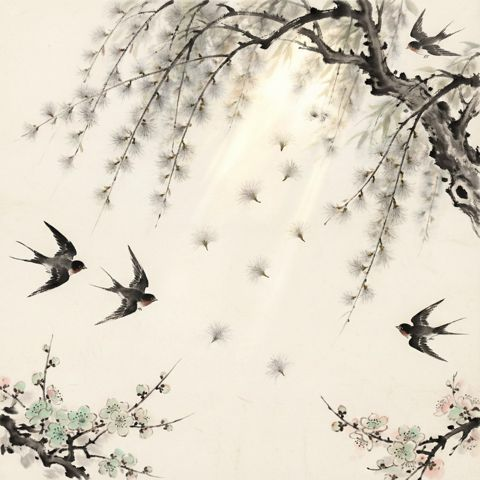 基图 0.244</td><td align="center"> F r1 · 0.265</td><td align="center">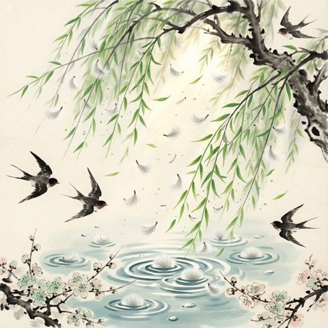 F r2 · 0.265</td><td align="center">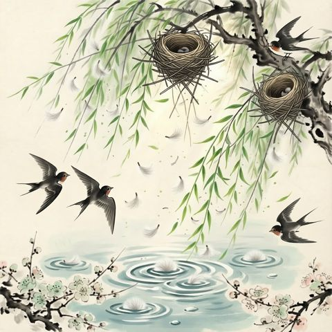 F r3 · 0.257</td><td align="center"> F 终图 · 0.265</td></tr>
<tr><td></td><td align="center"> L r1(R) · 0.240</td><td align="center">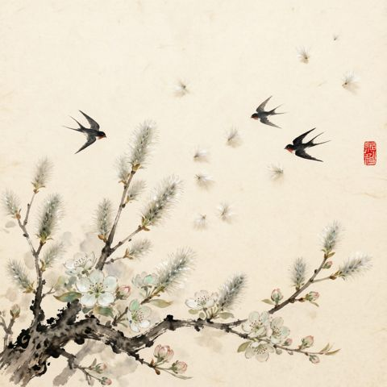 L r2(R) · 0.231</td><td align="center"> L r3(E) · 0.245</td><td align="center"> L 终图 · 0.245</td></tr>
</table>

## t02 · 夏蝉（自然·夏 · sparse）

> **写一首五言绝句，主题是夏蝉**
>
> 午夜鸣无数 / 声中无处知 / 秋来方始息 / 不似暮天时 —— 诗总分 0.843

CLIP raw：基图 **0.247** · F 轨迹 0.270 → 0.257 → 0.274 → 终值 **0.274** · L 轨迹 0.250 → 0.271 → 0.275 → 终值 **0.275**（决策 R R R）

<table>
<tr><td align="center">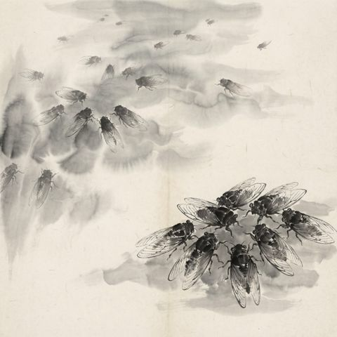 基图 0.247</td><td align="center">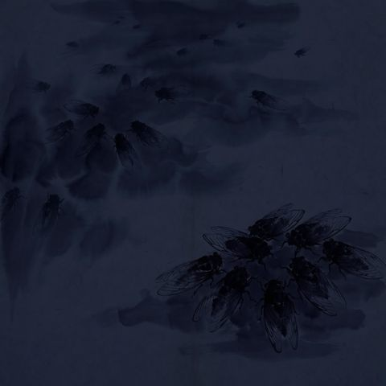 F r1 · 0.270</td><td align="center">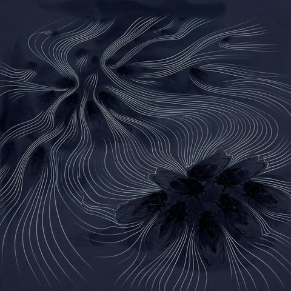 F r2 · 0.257</td><td align="center"> F r3 · 0.274</td><td align="center"> F 终图 · 0.274</td></tr>
<tr><td></td><td align="center">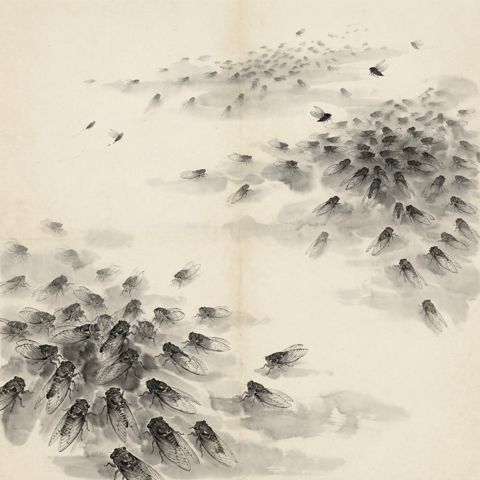 L r1(R) · 0.250</td><td align="center"> L r2(R) · 0.271</td><td align="center"> L r3(R) · 0.275</td><td align="center">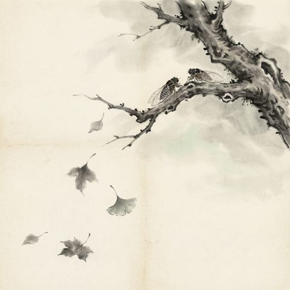 L 终图 · 0.275</td></tr>
</table>

## t03 · 秋夜疏桐（自然·秋 · rich）

> **写一首秋景的五言律诗，要有疏桐和寒蛩**
>
> 高梧生夜意 / 清漏断秋声 / 风定月华满 / 雨余天色明 / 疏桐栖宿鸟 / 寒蛩起晓机 / 独坐无佳思 / 相望忆旧情 —— 诗总分 0.909

CLIP raw：基图 **0.319** · F 轨迹 — → 终值 **0.319** · L 轨迹 — → 终值 **0.319**（决策 —）

<table><tr><td align="center"> 基图 0.319（已达标，两臂跳过循环）</td></tr></table>

## t04 · 寒梅独放（自然·冬 · sparse）

> **写一首五言绝句，主题是寒梅**
>
> 雪尽繁枝后 / 春风已数回 / 独留孤影在 / 不与众人开 —— 诗总分 0.925

CLIP raw：基图 **0.300** · F 轨迹 — → 终值 **0.300** · L 轨迹 — → 终值 **0.300**（决策 —）

<table><tr><td align="center">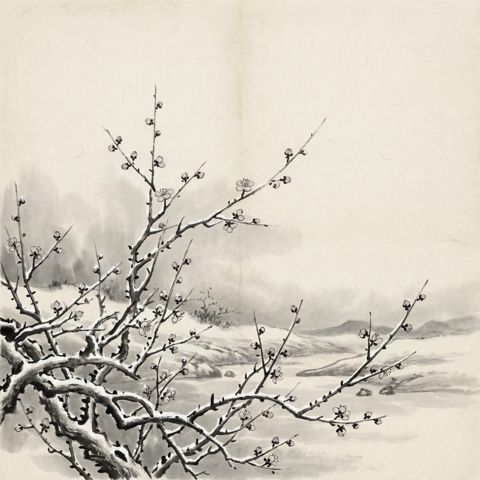 基图 0.300（已达标，两臂跳过循环）</td></tr></table>

## t05 · 溪声（山水 · sparse）

> **写一首五言绝句，主题是溪声**
>
> 万壑鸣清响 / 孤舟泛绿汀 / 溪边人语静 / 风起竹林青 —— 诗总分 0.925

CLIP raw：基图 **0.322** · F 轨迹 — → 终值 **0.322** · L 轨迹 — → 终值 **0.322**（决策 —）

<table><tr><td align="center"> 基图 0.322（已达标，两臂跳过循环）</td></tr></table>

## t06 · 村野耕牛（田园 · rich）

> **写一首田园的七言绝句，要有耕牛和炊烟**
>
> 小径通村野色平 / 茅茨深掩水泠泠 / 田家无事都闲了 / 但见耕牛傍树鸣 —— 诗总分 0.694

CLIP raw：基图 **0.290** · F 轨迹 0.292 → 0.294 → 0.263 → 终值 **0.294** · L 轨迹 0.283 → 0.285 → 0.281 → 终值 **0.290**（决策 R E R）

<table>
<tr><td align="center"> 基图 0.290</td><td align="center">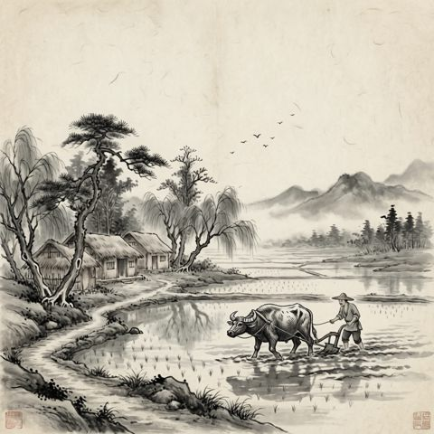 F r1 · 0.292</td><td align="center">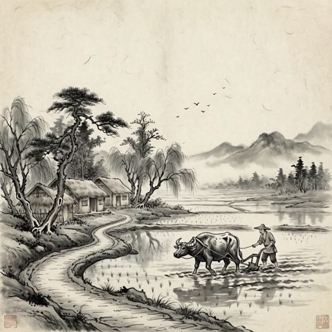 F r2 · 0.294</td><td align="center">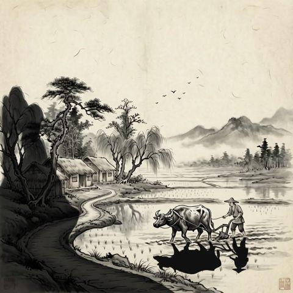 F r3 · 0.263</td><td align="center"> F 终图 · 0.294</td></tr>
<tr><td></td><td align="center">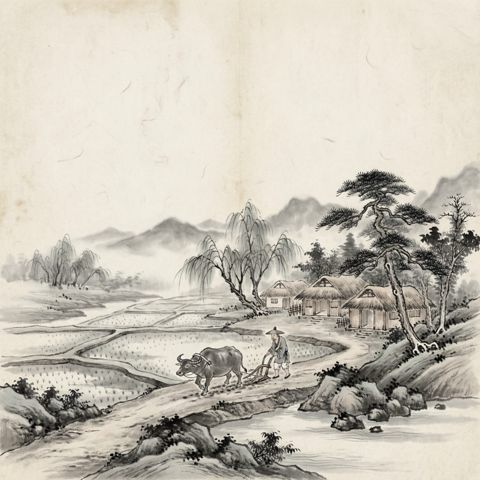 L r1(R) · 0.283</td><td align="center">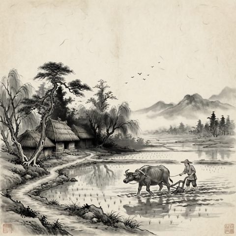 L r2(E) · 0.285</td><td align="center">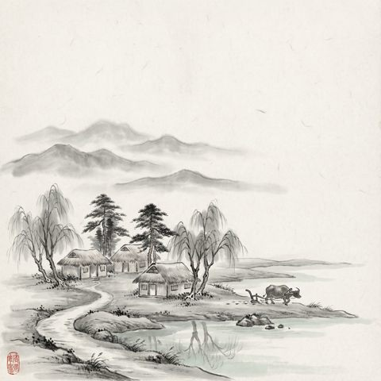 L r3(R) · 0.281</td><td align="center">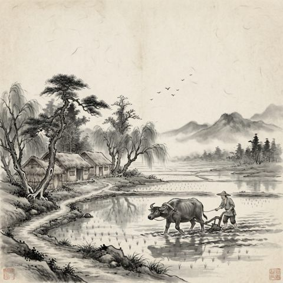 L 终图 · 0.290</td></tr>
</table>

## t07 · 戍楼角声（边塞 · rich）

> **写一首边塞的五言律诗，要有戍楼和角声**
>
> 戍楼风急夜 / 月色入寒沙 / 吹彻三更鼓 / 惊回万里笳 / 关山连楚汉 / 秋草满天涯 / 莫向高城望 / 乡心正有花 —— 诗总分 0.705

CLIP raw：基图 **0.328** · F 轨迹 — → 终值 **0.328** · L 轨迹 — → 终值 **0.328**（决策 —）

<table><tr><td align="center">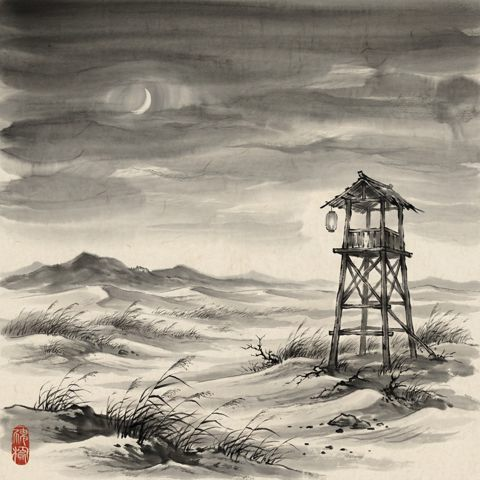 基图 0.328（已达标，两臂跳过循环）</td></tr></table>

## t08 · 客舍孤灯（羁旅 · rich）

> **写一首羁旅的五言绝句，要有客舍和孤灯**
>
> 客舍依稀近 / 孤灯耿耿寒 / 秋风生旅思 / 愁杀不归安 —— 诗总分 0.963

CLIP raw：基图 **0.284** · F 轨迹 0.304 → 终值 **0.304** · L 轨迹 0.272 → 0.287 → 0.268 → 终值 **0.287**（决策 R E R）

<table>
<tr><td align="center">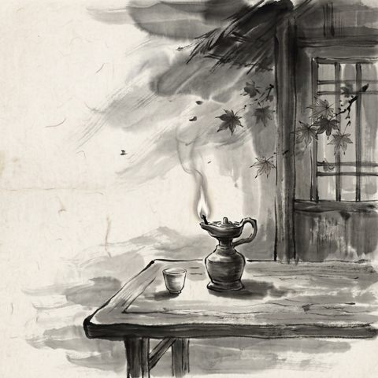 基图 0.284</td><td align="center"> F r1 · 0.304</td><td align="center"> F 终图 · 0.304</td></tr>
<tr><td></td><td align="center">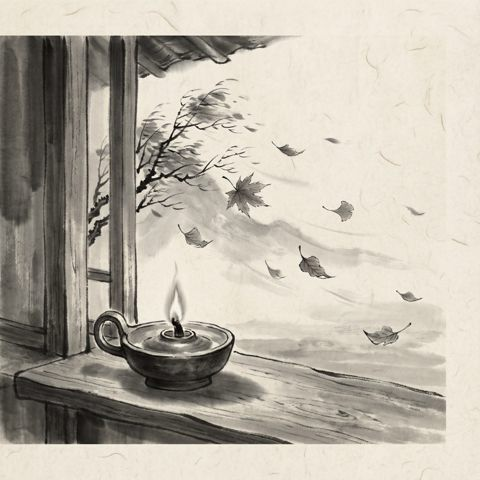 L r1(R) · 0.272</td><td align="center"> L r2(E) · 0.287</td><td align="center">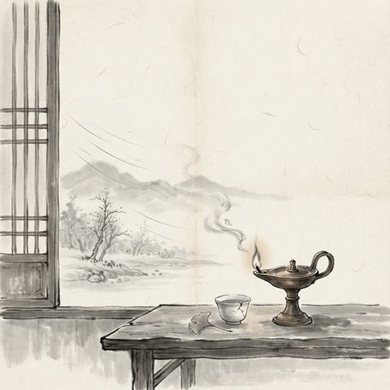 L r3(R) · 0.268</td><td align="center">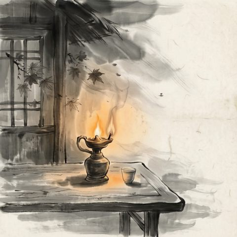 L 终图 · 0.287</td></tr>
</table>

## t09 · 江月送别（送别 · sparse）

> **写一首七言绝句，主题是送别**
>
> 相逢不见两凄然 / 一去迢遥路几千 / 此夕西风江上月 / 照君何处不潸然 —— 诗总分 0.926

CLIP raw：基图 **0.329** · F 轨迹 — → 终值 **0.329** · L 轨迹 — → 终值 **0.329**（决策 —）

<table><tr><td align="center">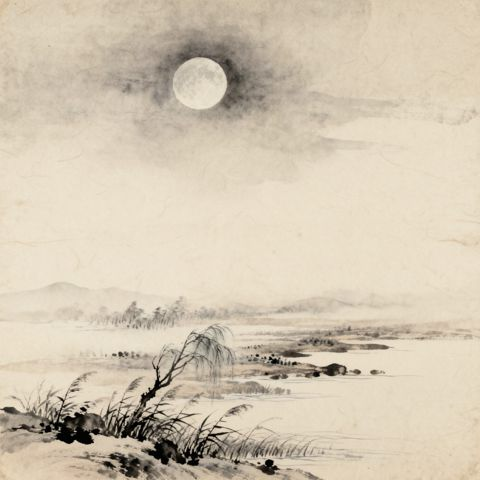 基图 0.329（已达标，两臂跳过循环）</td></tr></table>

## t10 · 古城荒台（怀古 · rich）

> **写一首怀古的五言律诗，要有古城和荒台**
>
> 千载古城址 / 空余荒台上 / 烟云无定所 / 风雨自相催 / 客思今如此 / 人情古亦来 / 不知何处火 / 犹作月明开 —— 诗总分 0.828

CLIP raw：基图 **0.275** · F 轨迹 0.283 → 0.305 → 终值 **0.305** · L 轨迹 0.326 → 终值 **0.326**（决策 R）

<table>
<tr><td align="center">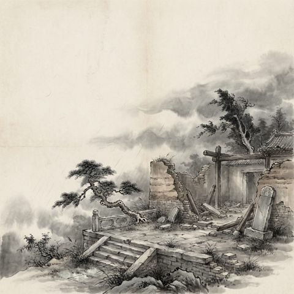 基图 0.275</td><td align="center"> F r1 · 0.283</td><td align="center"> F r2 · 0.305</td><td align="center"> F 终图 · 0.305</td></tr>
<tr><td></td><td align="center"> L r1(R) · 0.326</td><td align="center">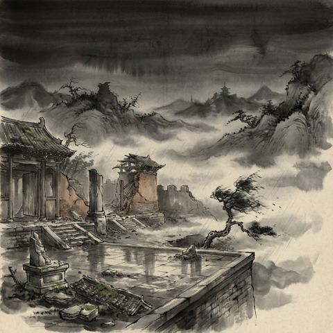 L 终图 · 0.326</td></tr>
</table>

## t11 · 中秋望月（节令 · rich）

> **写一首中秋的五言绝句，要有明月和团圆**
>
> 玉轮如皎洁 / 一月照吾乡 / 况有团圆夜 / 何须更断肠 —— 诗总分 0.937

CLIP raw：基图 **0.313** · F 轨迹 — → 终值 **0.313** · L 轨迹 — → 终值 **0.313**（决策 —）

<table><tr><td align="center">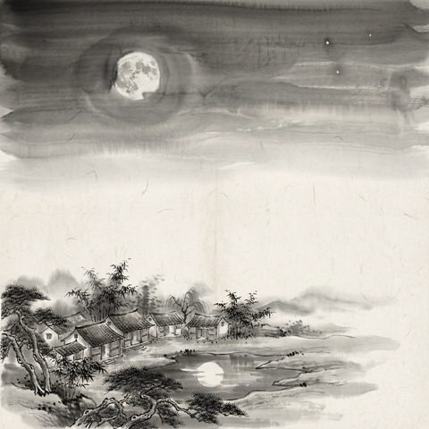 基图 0.313（已达标，两臂跳过循环）</td></tr></table>

## t12 · 山寺钟声（哲理 · rich）

> **写一首禅意的七言绝句，要有古刹和钟鼓**
>
> 山寺钟声出古刹 / 江城月色上疏林 / 老僧莫笑人间事 / 一榻风前睡亦深 —— 诗总分 0.975

CLIP raw：基图 **0.293** · F 轨迹 0.285 → 0.298 → 0.296 → 终值 **0.298** · L 轨迹 0.306 → 终值 **0.306**（决策 R）

<table>
<tr><td align="center"> 基图 0.293</td><td align="center"> F r1 · 0.285</td><td align="center"> F r2 · 0.298</td><td align="center"> F r3 · 0.296</td><td align="center"> F 终图 · 0.298</td></tr>
<tr><td></td><td align="center"> L r1(R) · 0.306</td><td align="center">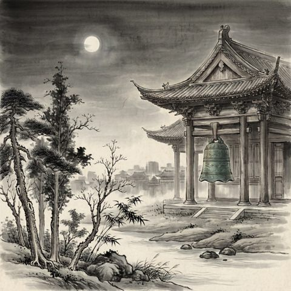 L 终图 · 0.306</td></tr>
</table>

## t13 · 春雨新晴（自然·春 · sparse）

> **写一首七言绝句，主题是春雨**
>
> 一雨新凉万里空 / 绿波飞涨碧粼粼 / 人闲不似山居处 / 却忆江头落日程 —— 诗总分 0.827

CLIP raw：基图 **0.279** · F 轨迹 0.293 → 0.289 → 0.278 → 终值 **0.293** · L 轨迹 0.265 → 0.258 → 0.293 → 终值 **0.293**（决策 R E E）

<table>
<tr><td align="center">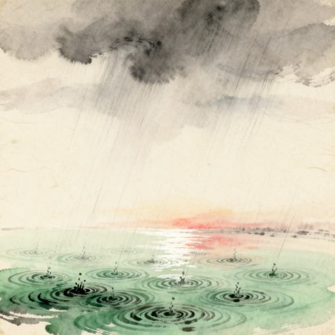 基图 0.279</td><td align="center"> F r1 · 0.293</td><td align="center">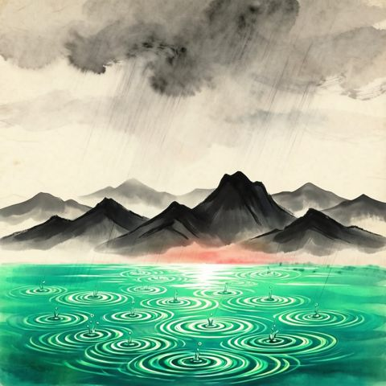 F r2 · 0.289</td><td align="center">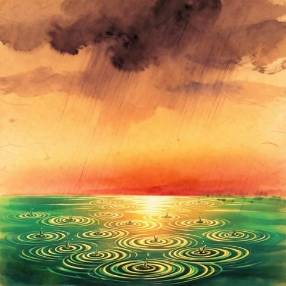 F r3 · 0.278</td><td align="center"> F 终图 · 0.293</td></tr>
<tr><td></td><td align="center">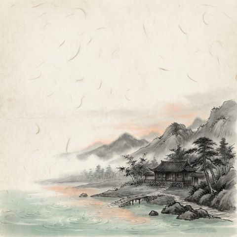 L r1(R) · 0.265</td><td align="center"> L r2(E) · 0.258</td><td align="center">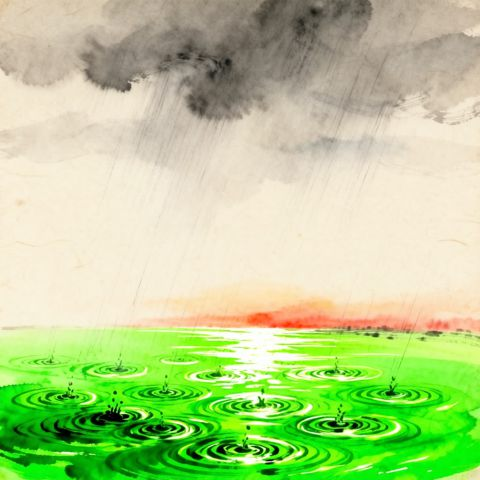 L r3(E) · 0.293</td><td align="center"> L 终图 · 0.293</td></tr>
</table>

## t14 · 消夏林亭（自然·夏 · sparse）

> **写一首五言律诗，主题是消夏**
>
> 竹叶为樽小 / 茅簷作室卑 / 雨多溪涨满 / 日正树阴垂 / 老病无他嗜 / 闲游独此时 / 清光谁与赏 / 明月属林披 —— 诗总分 0.887

CLIP raw：基图 **0.309** · F 轨迹 — → 终值 **0.309** · L 轨迹 — → 终值 **0.309**（决策 —）

<table><tr><td align="center">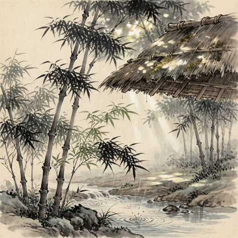 基图 0.309（已达标，两臂跳过循环）</td></tr></table>

## t15 · 悲秋客思（自然·秋 · sparse）

> **写一首七言律诗，主题是悲秋**
>
> 秋风又起暮云深 / 客枕无眠梦亦心 / 万里故乡空望断 / 百年孤老自愁吟 / 残灯寒火知人瘦 / 落叶微声忆事沈 / 衰疾不堪添酒病 / 何须更作赋归来 —— 诗总分 0.915

CLIP raw：基图 **0.269** · F 轨迹 0.274 → 0.293 → 0.266 → 终值 **0.293** · L 轨迹 0.304 → 终值 **0.304**（决策 E）

<table>
<tr><td align="center">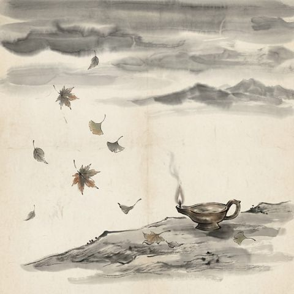 基图 0.269</td><td align="center">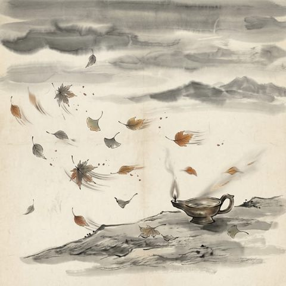 F r1 · 0.274</td><td align="center"> F r2 · 0.293</td><td align="center"> F r3 · 0.266</td><td align="center"> F 终图 · 0.293</td></tr>
<tr><td></td><td align="center"> L r1(E) · 0.304</td><td align="center"> L 终图 · 0.304</td></tr>
</table>

## t16 · 飞雪寒鸦（自然·冬 · rich）

> **写一首冬景的七言绝句，要有飞雪和寒鸦**
>
> 山深无处不松筠 / 尽日看云坐石滨 / 飞雪已惊残腊暮 / 寒鸦犹噪小园春 —— 诗总分 0.912

CLIP raw：基图 **0.314** · F 轨迹 — → 终值 **0.314** · L 轨迹 — → 终值 **0.314**（决策 —）

<table><tr><td align="center">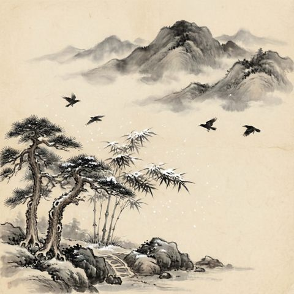 基图 0.314（已达标，两臂跳过循环）</td></tr></table>

## t17 · 高楼望远（山水 · rich）

> **写一首山水的七言律诗，要有高楼和远山**
>
> 万古江山自昔来 / 登临不改旧风埃 / 天连沧海云千片 / 地接江湖月一杯 / 鸟唤晚凉栖碧树 / 人从空际望青苔 / 谁将故老为君说 / 万里高楼入画图 —— 诗总分 0.893

CLIP raw：基图 **0.311** · F 轨迹 — → 终值 **0.311** · L 轨迹 — → 终值 **0.311**（决策 —）

<table><tr><td align="center">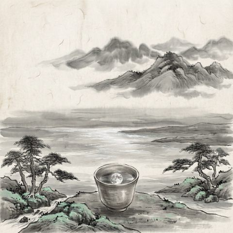 基图 0.311（已达标，两臂跳过循环）</td></tr></table>

## t18 · 归隐山林（田园 · sparse）

> **写一首五言律诗，主题是归隐**
>
> 世事真无计 / 人情总自亲 / 山林方独往 / 天地欲谁邻 / 野性元和俗 / 穷年莫与贫 / 何如归故里 / 长日看青云 —— 诗总分 0.915

CLIP raw：基图 **0.268** · F 轨迹 0.272 → 0.285 → 0.267 → 终值 **0.285** · L 轨迹 0.280 → 0.284 → 0.282 → 终值 **0.284**（决策 R R E）

<table>
<tr><td align="center">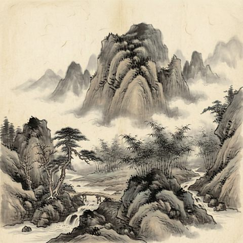 基图 0.268</td><td align="center">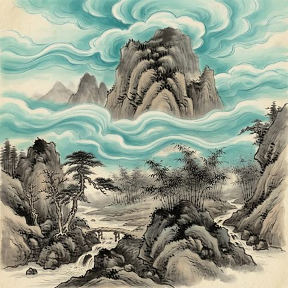 F r1 · 0.272</td><td align="center"> F r2 · 0.285</td><td align="center"> F r3 · 0.267</td><td align="center"> F 终图 · 0.285</td></tr>
<tr><td></td><td align="center">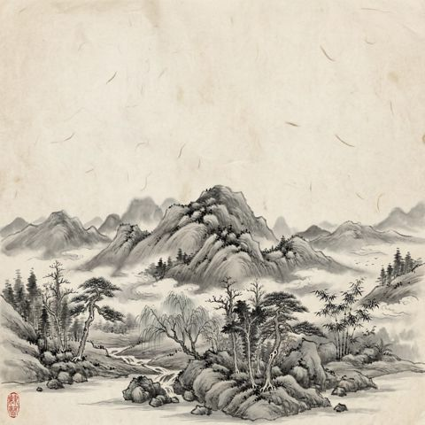 L r1(R) · 0.280</td><td align="center"> L r2(R) · 0.284</td><td align="center">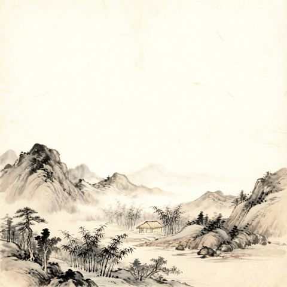 L r3(E) · 0.282</td><td align="center">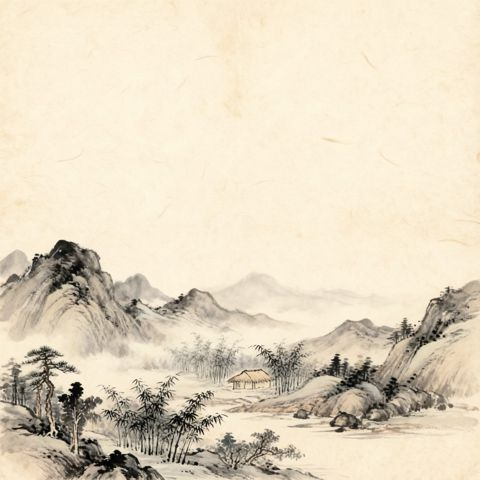 L 终图 · 0.284</td></tr>
</table>

## t19 · 边烽入贺秦（边塞 · sparse）

> **写一首七言绝句，主题是征戍**
>
> 塞外风沙起战尘 / 军书未报玉门春 / 君王若问苍生苦 / 且听边烽入贺秦 —— 诗总分 0.937

CLIP raw：基图 **0.288** · F 轨迹 0.262 → 0.275 → 0.234 → 终值 **0.288** · L 轨迹 0.276 → 0.312 → 终值 **0.312**（决策 R R）

<table>
<tr><td align="center">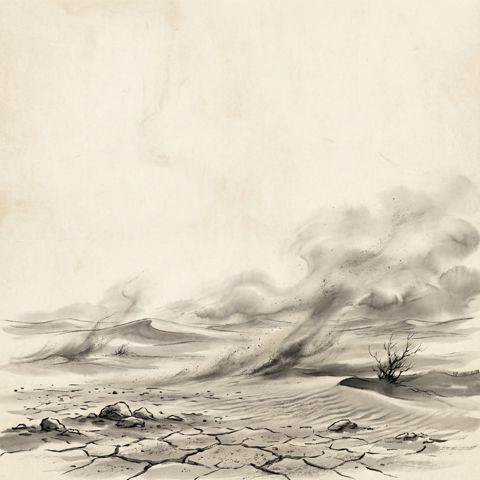 基图 0.288</td><td align="center">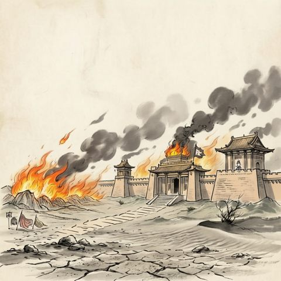 F r1 · 0.262</td><td align="center">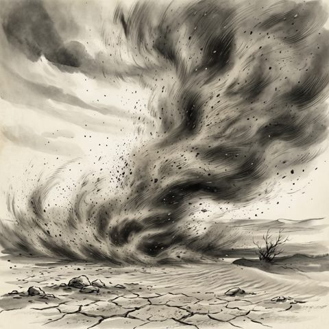 F r2 · 0.275</td><td align="center">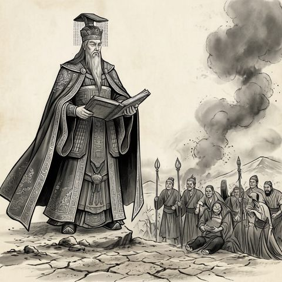 F r3 · 0.234</td><td align="center"> F 终图 · 0.288</td></tr>
<tr><td></td><td align="center">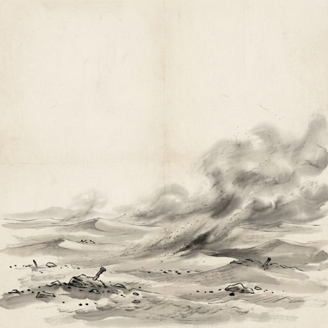 L r1(R) · 0.276</td><td align="center"> L r2(R) · 0.312</td><td align="center">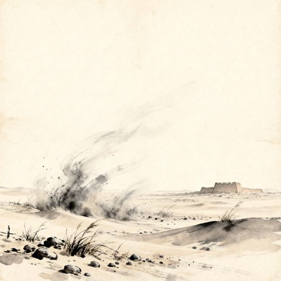 L 终图 · 0.312</td></tr>
</table>

## t20 · 客愁（羁旅 · sparse）

> **写一首七言律诗，主题是客愁**
>
> 久客天涯忆故园 / 夜深清晓更阑干 / 风霜满鬓须眉雪 / 山水无家岁月残 / 欲识旧交心更苦 / 空闻新贵口多谈 / 归欤自笑功名薄 / 犹得君恩借醉酣 —— 诗总分 0.869

CLIP raw：基图 **0.257** · F 轨迹 0.273 → 0.274 → 0.238 → 终值 **0.274** · L 轨迹 0.271 → 0.268 → 0.281 → 终值 **0.281**（决策 R R R）

<table>
<tr><td align="center">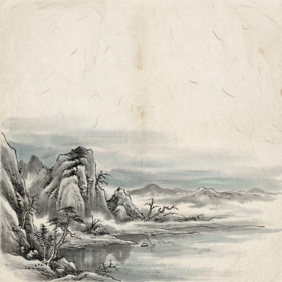 基图 0.257</td><td align="center">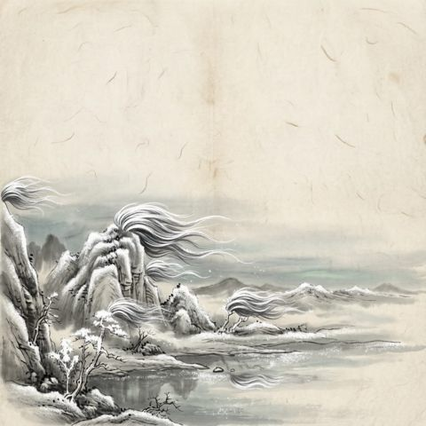 F r1 · 0.273</td><td align="center"> F r2 · 0.274</td><td align="center">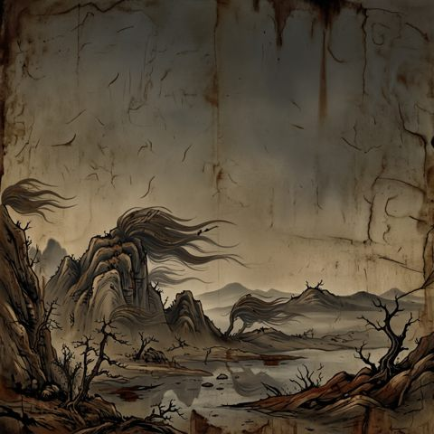 F r3 · 0.238</td><td align="center"> F 终图 · 0.274</td></tr>
<tr><td></td><td align="center">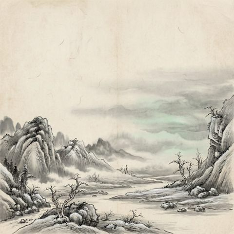 L r1(R) · 0.271</td><td align="center">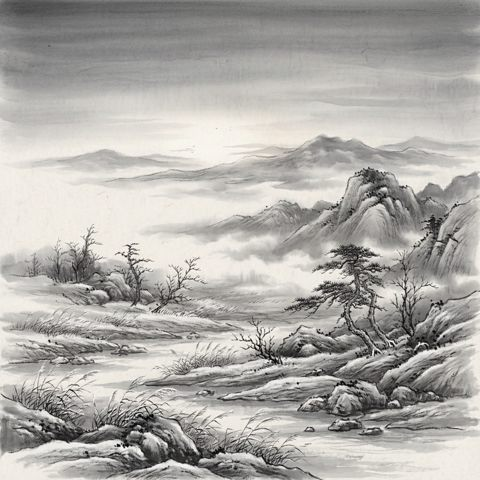 L r2(R) · 0.268</td><td align="center">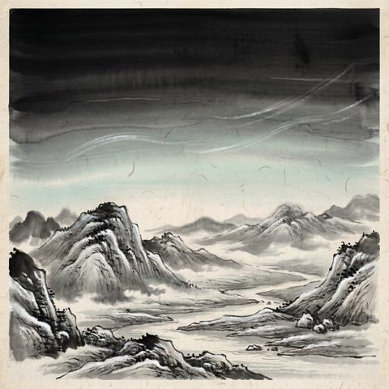 L r3(R) · 0.281</td><td align="center"> L 终图 · 0.281</td></tr>
</table>

## t21 · 长亭折柳（送别 · rich）

> **写一首送别的七言律诗，要有长亭和折柳**
>
> 长亭折柳意凄然 / 落日归帆影渺然 / 别酒欲辞樽且醉 / 故人无寄泪空潸 / 孤舟过尽寒云起 / 斜雁行多远水天 / 此去相逢应未晚 / 明朝相望路何绵 —— 诗总分 0.893

CLIP raw：基图 **0.317** · F 轨迹 — → 终值 **0.317** · L 轨迹 — → 终值 **0.317**（决策 —）

<table><tr><td align="center">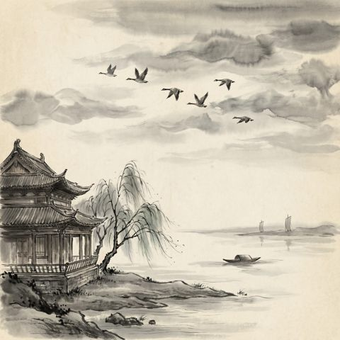 基图 0.317（已达标，两臂跳过循环）</td></tr></table>

## t22 · 江楼吊古（怀古 · sparse）

> **写一首七言律诗，主题是吊古**
>
> 江畔楼头见杜鹃 / 凄凉春色暗残年 / 一川飞雨催归客 / 千里荒村带暮烟 / 老去故山知不远 / 梦回孤剑想重悬 / 西风落木寒江上 / 谁倚危樯泪满鞭 —— 诗总分 0.926

CLIP raw：基图 **0.294** · F 轨迹 0.250 → 0.298 → 0.300 → 终值 **0.300** · L 轨迹 0.319 → 终值 **0.319**（决策 R）

<table>
<tr><td align="center">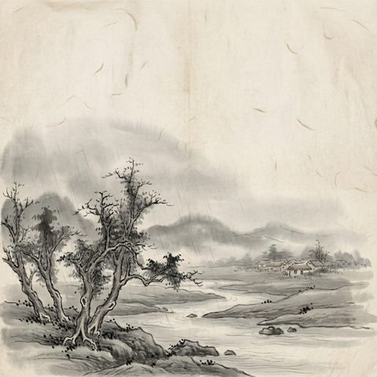 基图 0.294</td><td align="center">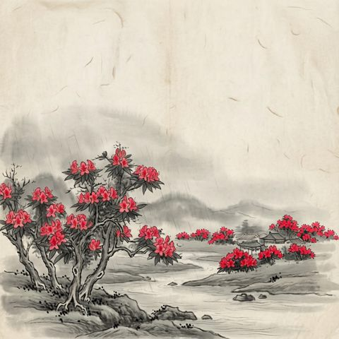 F r1 · 0.250</td><td align="center">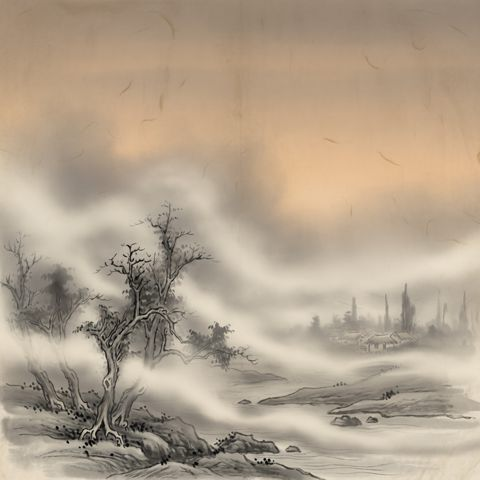 F r2 · 0.298</td><td align="center"> F r3 · 0.300</td><td align="center">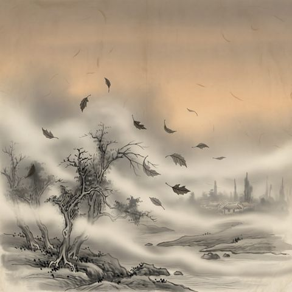 F 终图 · 0.300</td></tr>
<tr><td></td><td align="center"> L r1(R) · 0.319</td><td align="center">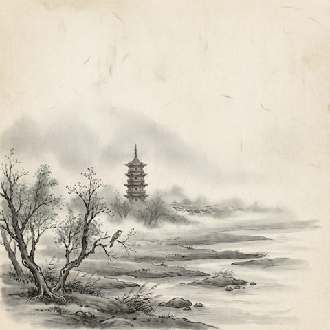 L 终图 · 0.319</td></tr>
</table>

## t23 · 重阳登高（节令 · sparse）

> **写一首五言律诗，主题是重阳**
>
> 登高今又近 / 佳节几时同 / 秋气初成露 / 寒威始著风 / 菊英开旧圃 / 萸子插新丛 / 独恨无仙术 / 还为老病翁 —— 诗总分 0.870

CLIP raw：基图 **0.323** · F 轨迹 — → 终值 **0.323** · L 轨迹 — → 终值 **0.323**（决策 —）

<table><tr><td align="center">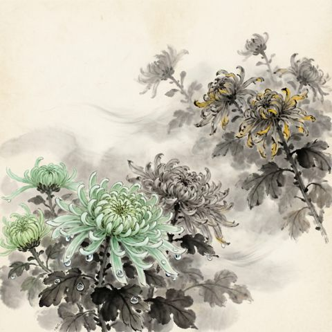 基图 0.323（已达标，两臂跳过循环）</td></tr></table>

## t24 · 无常偈（哲理 · sparse）

> **写一首五言绝句，主题是无常**
>
> 无常何所救 / 尽处可投机 / 且住勿惊怕 / 随缘即涅槃 —— 诗总分 0.915

CLIP raw：基图 **0.269** · F 轨迹 0.279 → 0.257 → 0.283 → 终值 **0.283** · L 轨迹 0.263 → 0.257 → 0.285 → 终值 **0.285**（决策 R R R）

<table>
<tr><td align="center">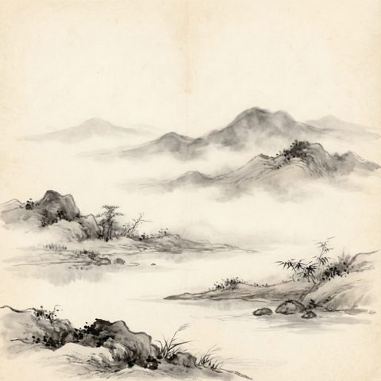 基图 0.269</td><td align="center">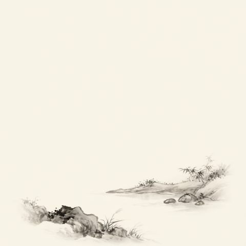 F r1 · 0.279</td><td align="center"> F r2 · 0.257</td><td align="center">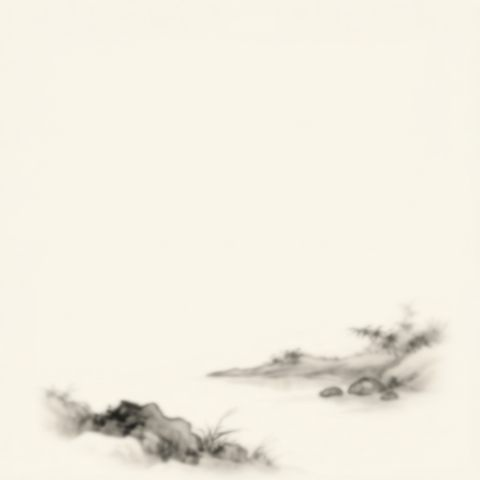 F r3 · 0.283</td><td align="center"> F 终图 · 0.283</td></tr>
<tr><td></td><td align="center">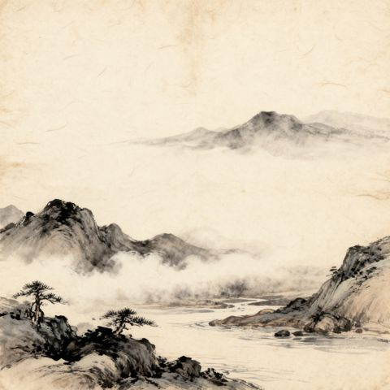 L r1(R) · 0.263</td><td align="center">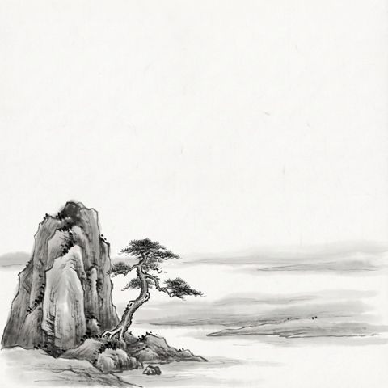 L r2(R) · 0.257</td><td align="center"> L r3(R) · 0.285</td><td align="center">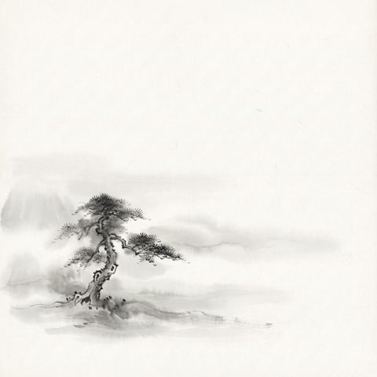 L 终图 · 0.285</td></tr>
</table>

## t25 · 春日莺花（自然·春 · rich）

> **写一首春景的五言律诗，要有桃花和啼莺**
>
> 雨晴芳树色 / 燕语落花天 / 草露侵红脸 / 桃花照碧烟 / 啼莺争婉啭 / 舞蝶自翩翻 / 莫恨春将去 / 流莺正可鞭 —— 诗总分 0.893

CLIP raw：基图 **0.323** · F 轨迹 — → 终值 **0.323** · L 轨迹 — → 终值 **0.323**（决策 —）

<table><tr><td align="center">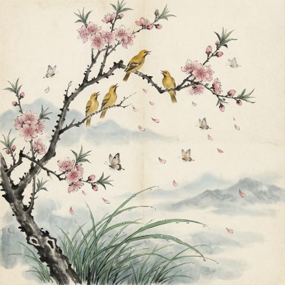 基图 0.323（已达标，两臂跳过循环）</td></tr></table>

## t26 · 雪夜独吟（自然·冬 · sparse）

> **写一首五言律诗，主题是雪夜**
>
> 雪霁清宵里 / 松风鸣独吟 / 孤高天外月 / 静极夜深心 / 影入寒窗竹 / 香侵晓幌衾 / 遥思白玉蟾 / 照水看云深 —— 诗总分 0.926

CLIP raw：基图 **0.357** · F 轨迹 — → 终值 **0.357** · L 轨迹 — → 终值 **0.357**（决策 —）

<table><tr><td align="center">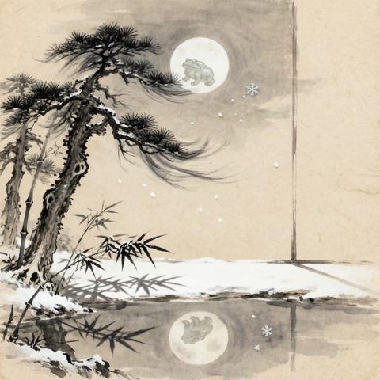 基图 0.357（已达标，两臂跳过循环）</td></tr></table>

## t27 · 冬夜炉火（自然·冬 · rich）

> **写一首冬景的七言律诗，要有炉火和寒灯**
>
> 夜来风雪打窗扉 / 寒漏初传一炷灰 / 梦断晓云残月色 / 坐看炉火下阶墀 / 山高水远空无伴 / 天地阴晴独有知 / 明日相思须酒饮 / 不妨长醉莫多炊 —— 诗总分 0.621

CLIP raw：基图 **0.341** · F 轨迹 — → 终值 **0.341** · L 轨迹 — → 终值 **0.341**（决策 —）

<table><tr><td align="center">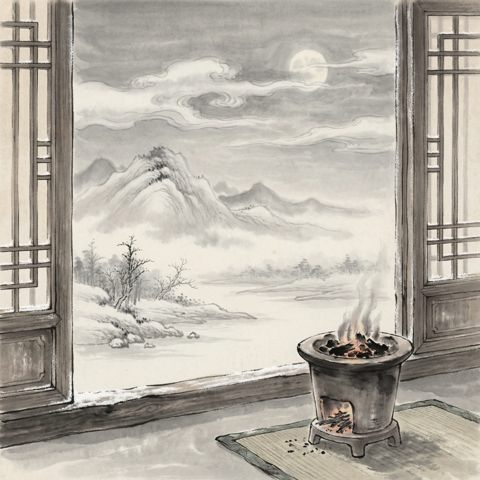 基图 0.341（已达标，两臂跳过循环）</td></tr></table>
