# 实验 B run 2 图库 · 诗 → 基图 → 逐轮改图 → 两臂终图（n=27）

同条件独立重复（预登记见 `eval/eval_llm_loop_ab.py` docstring run 2 节）。
图例同 run 1：r1/r2/r3=逐轮中间图，终图=历史最优回写；F=写死臂，L=LLM 臂（R=rewrite_regen，E=edit_api）。
对照分析见 `../../REPORT_llm_loop_ab_run2_20260711.md`。

## t01 · 柳燕春景（自然·春 · rich）

> **写一首春景的五言绝句，要有柳树和燕子**
>
> 花柳映窗纱 / 春风几日华 / 柳边闲送客 / 燕外又飞鸦 —— 诗总分 0.843

CLIP raw：基图 **0.328** · F 轨迹 — → 终值 **0.328** · L 轨迹 — → 终值 **0.328**（决策 —）

<table><tr><td align="center">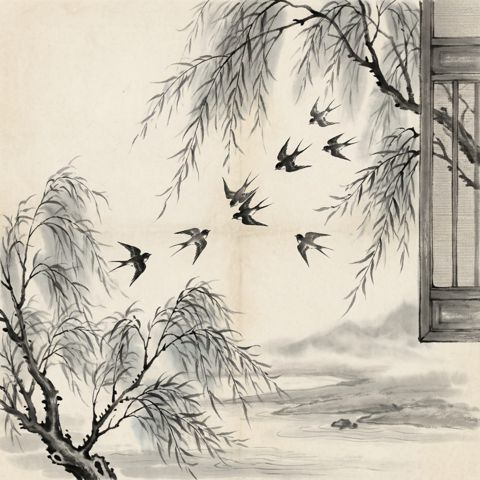 基图 0.328（已达标，两臂跳过循环）</td></tr></table>

## t02 · 夏蝉吟（自然·夏 · sparse）

> **写一首五言绝句，主题是夏蝉**
>
> 风清池水绿 / 日暖夏蝉高 / 何用鸣千载 / 吾心与物交 —— 诗总分 0.827

CLIP raw：基图 **0.282** · F 轨迹 0.299 → 0.293 → 0.333 → 终值 **0.333** · L 轨迹 0.290 → 0.279 → 0.291 → 终值 **0.291**（决策 R R R）

<table>
<tr><td align="center">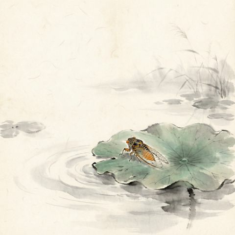 基图 0.282</td><td align="center">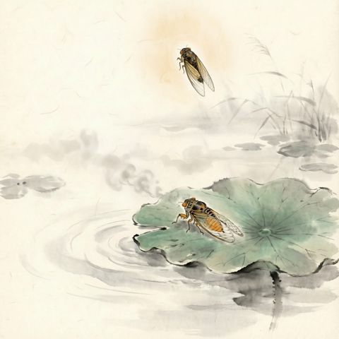 F r1 · 0.299</td><td align="center"> F r2 · 0.293</td><td align="center">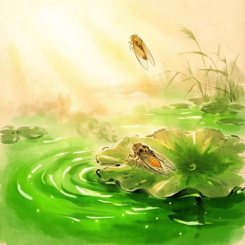 F r3 · 0.333</td><td align="center"> F 终图 · 0.333</td></tr>
<tr><td></td><td align="center">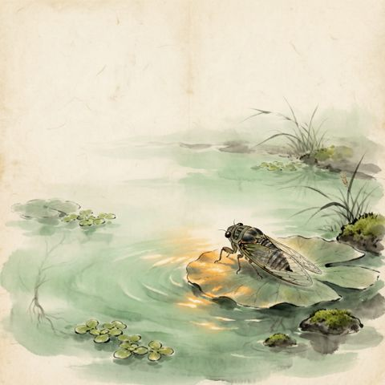 L r1(R) · 0.290</td><td align="center">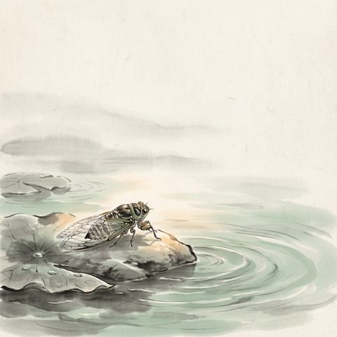 L r2(R) · 0.279</td><td align="center"> L r3(R) · 0.291</td><td align="center">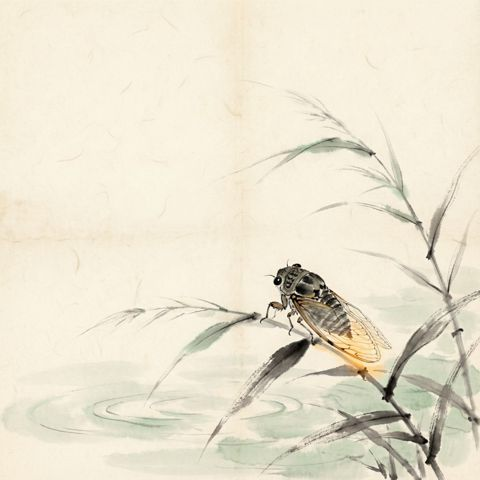 L 终图 · 0.291</td></tr>
</table>

## t03 · 秋桐寒蛩（自然·秋 · rich）

> **写一首秋景的五言律诗，要有疏桐和寒蛩**
>
> 疏桐高且劲 / 寒蛩静复稀 / 未肯随车马 / 宁无恋岁归 / 风霜清野色 / 草木暗山扉 / 况是离居客 / 愁心更不开 —— 诗总分 0.871

CLIP raw：基图 **0.286** · F 轨迹 0.277 → 0.274 → 0.281 → 终值 **0.286** · L 轨迹 0.274 → 0.297 → 0.295 → 终值 **0.297**（决策 R R R）

<table>
<tr><td align="center">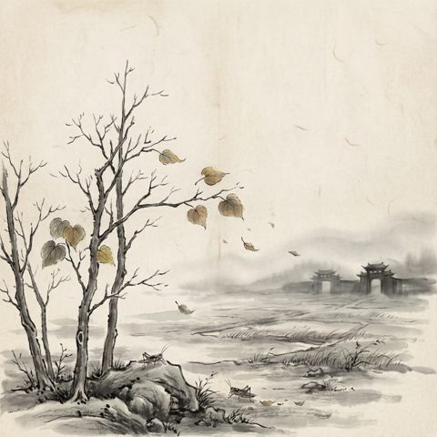 基图 0.286</td><td align="center">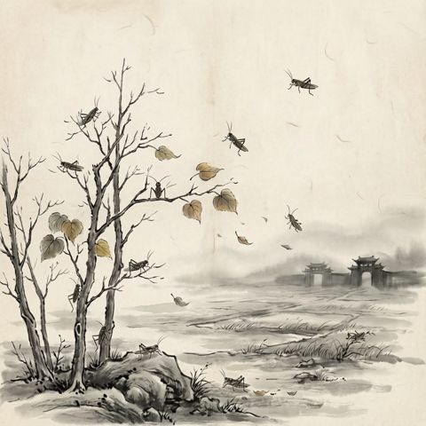 F r1 · 0.277</td><td align="center">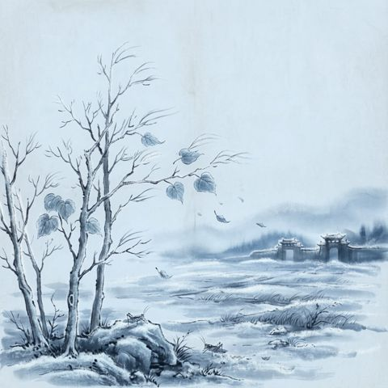 F r2 · 0.274</td><td align="center">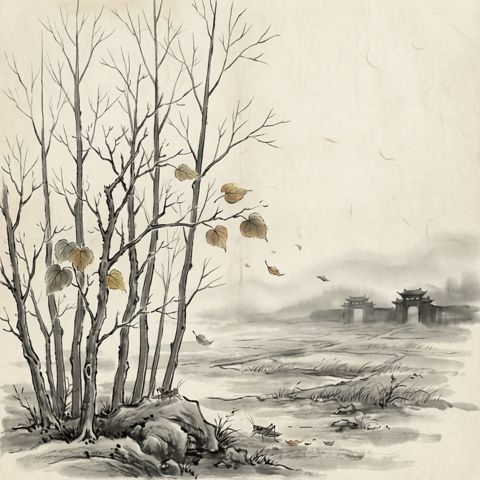 F r3 · 0.281</td><td align="center"> F 终图 · 0.286</td></tr>
<tr><td></td><td align="center">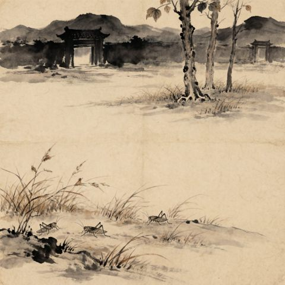 L r1(R) · 0.274</td><td align="center"> L r2(R) · 0.297</td><td align="center">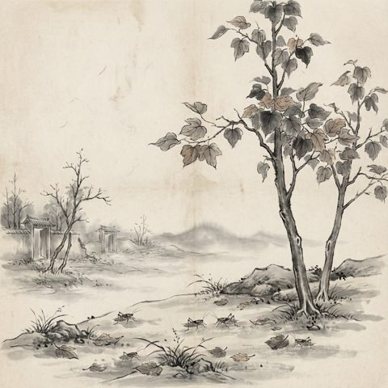 L r3(R) · 0.295</td><td align="center">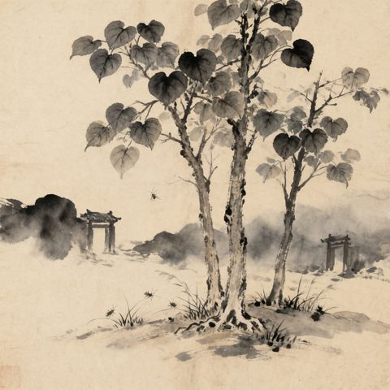 L 终图 · 0.297</td></tr>
</table>

## t04 · 寒梅笛韵（自然·冬 · sparse）

> **写一首五言绝句，主题是寒梅**
>
> 雪外无他景 / 幽人自可娱 / 山空有风笛 / 吹落野梅花 —— 诗总分 0.915

CLIP raw：基图 **0.368** · F 轨迹 — → 终值 **0.368** · L 轨迹 — → 终值 **0.368**（决策 —）

<table><tr><td align="center">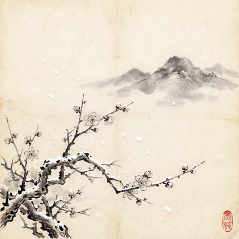 基图 0.368（已达标，两臂跳过循环）</td></tr></table>

## t05 · 溪声禅意（山水 · sparse）

> **写一首五言绝句，主题是溪声**
>
> 石涧流声远 / 云山鸟道深 / 松根闻古刹 / 竹叶听禅心 —— 诗总分 0.925

CLIP raw：基图 **0.324** · F 轨迹 — → 终值 **0.324** · L 轨迹 — → 终值 **0.324**（决策 —）

<table><tr><td align="center">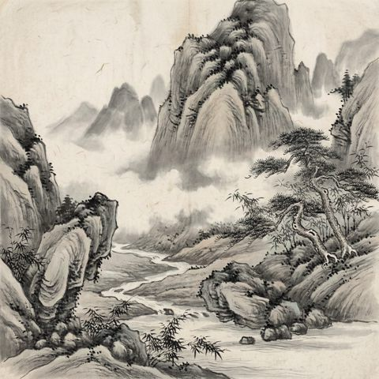 基图 0.324（已达标，两臂跳过循环）</td></tr></table>

## t06 · 春野耕牛（田园 · rich）

> **写一首田园的七言绝句，要有耕牛和炊烟**
>
> 春雨翻飞晓雾天 / 绿肥黄瘦一村田 / 老农莫叹无衣食 / 但见耕牛满野眠 —— 诗总分 0.647

CLIP raw：基图 **0.321** · F 轨迹 — → 终值 **0.321** · L 轨迹 — → 终值 **0.321**（决策 —）

<table><tr><td align="center">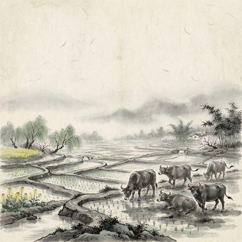 基图 0.321（已达标，两臂跳过循环）</td></tr></table>

## t07 · 戍楼角声（边塞 · rich）

> **写一首边塞的五言律诗，要有戍楼和角声**
>
> 戍楼吹角动 / 山郭起秋风 / 野迥人归早 / 河空雁度鸿 / 草黄榆叶短 / 月白露华浓 / 欲问南飞鸟 / 先随东去鸿 —— 诗总分 0.670

CLIP raw：基图 **0.334** · F 轨迹 — → 终值 **0.334** · L 轨迹 — → 终值 **0.334**（决策 —）

<table><tr><td align="center">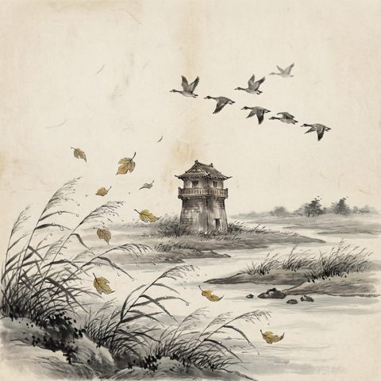 基图 0.334（已达标，两臂跳过循环）</td></tr></table>

## t08 · 客舍孤灯（羁旅 · rich）

> **写一首羁旅的五言绝句，要有客舍和孤灯**
>
> 客舍青门远 / 孤灯碧树寒 / 不堪秋日暮 / 还作雨声阑 —— 诗总分 1.000

CLIP raw：基图 **0.264** · F 轨迹 0.281 → 0.317 → 终值 **0.317** · L 轨迹 0.281 → 0.286 → 0.282 → 终值 **0.286**（决策 R E E）

<table>
<tr><td align="center">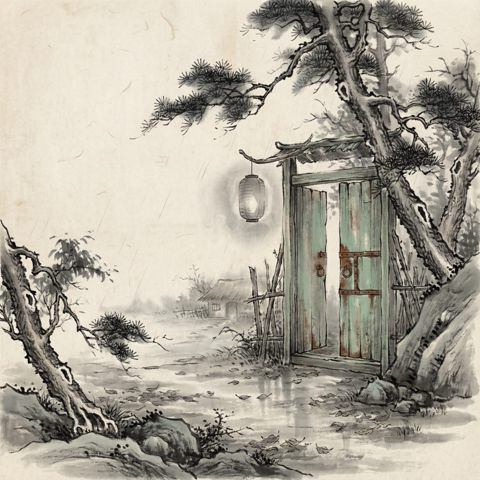 基图 0.264</td><td align="center">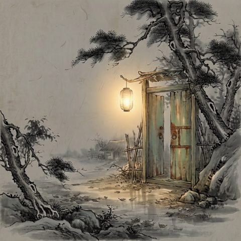 F r1 · 0.281</td><td align="center">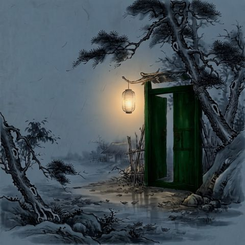 F r2 · 0.317</td><td align="center"> F 终图 · 0.317</td></tr>
<tr><td></td><td align="center">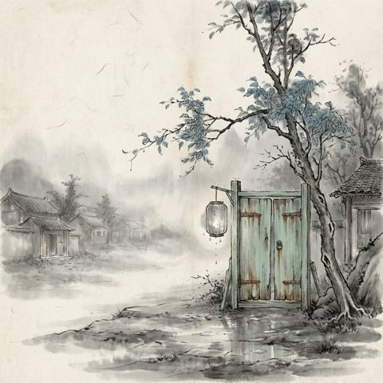 L r1(R) · 0.281</td><td align="center"> L r2(E) · 0.286</td><td align="center"> L r3(E) · 0.282</td><td align="center"> L 终图 · 0.286</td></tr>
</table>

## t09 · 雨晴送别（送别 · sparse）

> **写一首七言绝句，主题是送别**
>
> 雨晴风暖柳垂丝 / 归客匆匆趁日迟 / 欲问故人今夜宿 / 却惊明月上高枝 —— 诗总分 0.925

CLIP raw：基图 **0.311** · F 轨迹 — → 终值 **0.311** · L 轨迹 — → 终值 **0.311**（决策 —）

<table><tr><td align="center">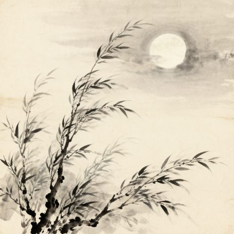 基图 0.311（已达标，两臂跳过循环）</td></tr></table>

## t10 · 古城怀古（怀古 · rich）

> **写一首怀古的五言律诗，要有古城和荒台**
>
> 古邑荒台冷 / 平沙远水深 / 云收秦塞月 / 雪暗汉陵金 / 野草连天白 / 秋鸿过岭沈 / 行人应怅望 / 江树正青阴 —— 诗总分 0.705

CLIP raw：基图 **0.277** · F 轨迹 0.262 → 0.276 → 0.276 → 终值 **0.277** · L 轨迹 0.318 → 终值 **0.318**（决策 R）

<table>
<tr><td align="center">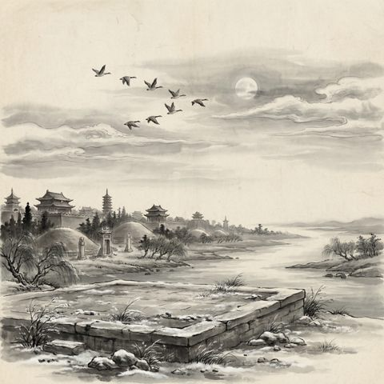 基图 0.277</td><td align="center">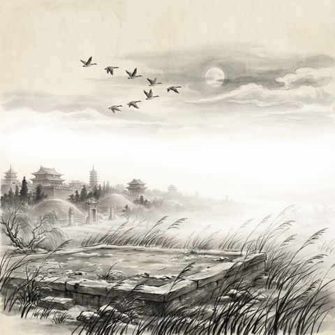 F r1 · 0.262</td><td align="center">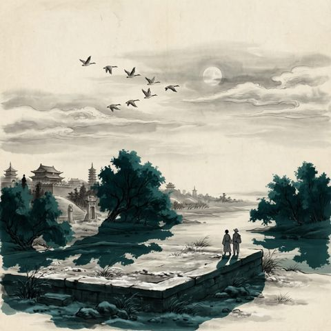 F r2 · 0.276</td><td align="center">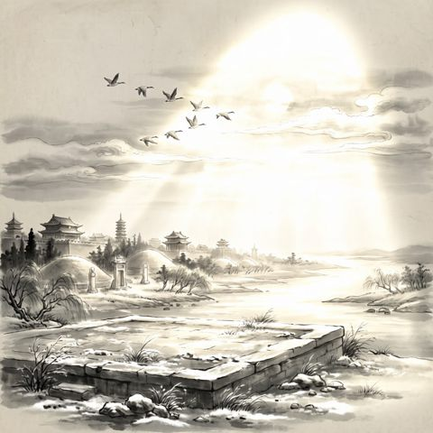 F r3 · 0.276</td><td align="center"> F 终图 · 0.277</td></tr>
<tr><td></td><td align="center"> L r1(R) · 0.318</td><td align="center">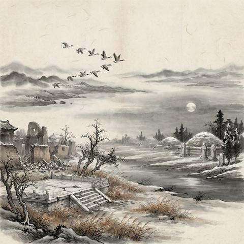 L 终图 · 0.318</td></tr>
</table>

## t11 · 中秋望月（节令 · rich）

> **写一首中秋的五言绝句，要有明月和团圆**
>
> 夜深人寂寂 / 明月上高楼 / 独有团圆意 / 无如未是秋 —— 诗总分 0.887

CLIP raw：基图 **0.273** · F 轨迹 0.288 → 0.281 → 0.314 → 终值 **0.314** · L 轨迹 0.267 → 0.278 → 0.300 → 终值 **0.300**（决策 R R R）

<table>
<tr><td align="center"> 基图 0.273</td><td align="center"> F r1 · 0.288</td><td align="center"> F r2 · 0.281</td><td align="center"> F r3 · 0.314</td><td align="center"> F 终图 · 0.314</td></tr>
<tr><td></td><td align="center"> L r1(R) · 0.267</td><td align="center"> L r2(R) · 0.278</td><td align="center"> L r3(R) · 0.300</td><td align="center"> L 终图 · 0.300</td></tr>
</table>

## t12 · 古刹钟声（哲理 · rich）

> **写一首禅意的七言绝句，要有古刹和钟鼓**
>
> 古刹钟声出翠微 / 山僧自说是南箕 / 我来为报天边月 / 却到人间亦可知 —— 诗总分 0.887

CLIP raw：基图 **0.300** · F 轨迹 — → 终值 **0.300** · L 轨迹 — → 终值 **0.300**（决策 —）

<table><tr><td align="center">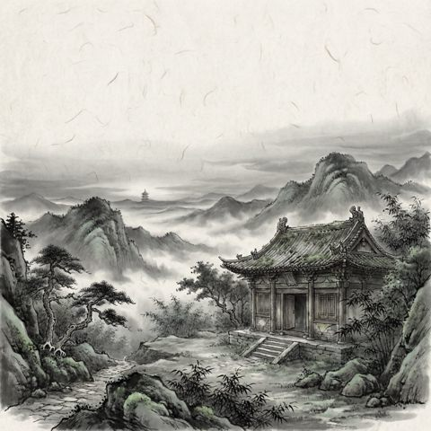 基图 0.300（已达标，两臂跳过循环）</td></tr></table>

## t13 · 春雨夜行（自然·春 · sparse）

> **写一首七言绝句，主题是春雨**
>
> 山中夜半起孤云 / 雨气濛濛暗塞门 / 不作飞鸿来远客 / 只因春水送行人 —— 诗总分 0.925

CLIP raw：基图 **0.298** · F 轨迹 0.314 → 终值 **0.314** · L 轨迹 0.303 → 终值 **0.303**（决策 R）

<table>
<tr><td align="center">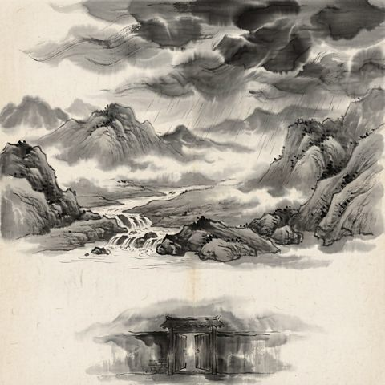 基图 0.298</td><td align="center">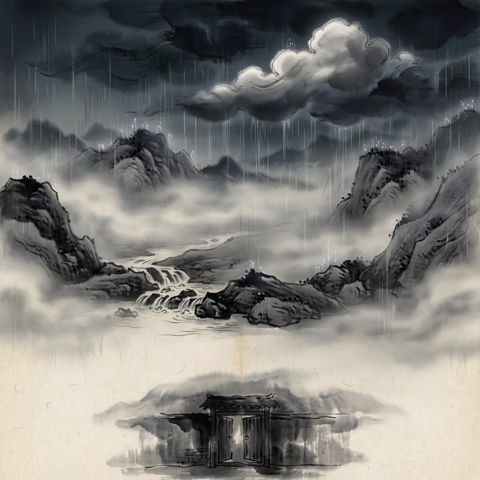 F r1 · 0.314</td><td align="center"> F 终图 · 0.314</td></tr>
<tr><td></td><td align="center">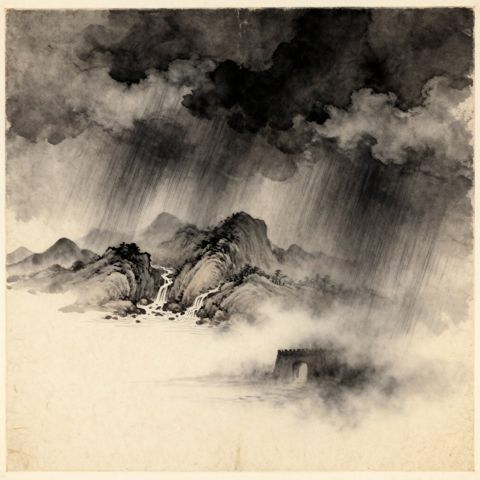 L r1(R) · 0.303</td><td align="center"> L 终图 · 0.303</td></tr>
</table>

## t14 · 消夏（自然·夏 · sparse）

> **写一首五言律诗，主题是消夏**
>
> 日薄阴方合 / 风清意自安 / 竹间多小月 / 花底有余寒 / 暑至犹忧扇 / 秋来岂厌餐 / 更知人亦苦 / 谁念此中欢 —— 诗总分 0.925

CLIP raw：基图 **0.300** · F 轨迹 — → 终值 **0.300** · L 轨迹 — → 终值 **0.300**（决策 —）

<table><tr><td align="center">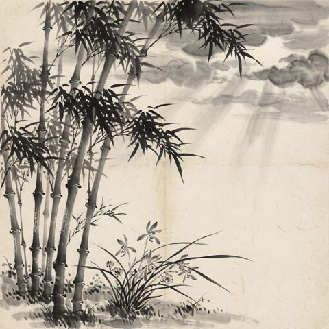 基图 0.300（已达标，两臂跳过循环）</td></tr></table>

## t15 · 悲秋客怀（自然·秋 · sparse）

> **写一首七言律诗，主题是悲秋**
>
> 客怀不似去年愁 / 一梦云山过白头 / 日暮寒侵黄叶径 / 风高夜半白云楼 / 霜林尽老无归计 / 野水初生有渡舟 / 衰病不知今夕是 / 且凭红烛话桑柔 —— 诗总分 0.879

CLIP raw：基图 **0.341** · F 轨迹 — → 终值 **0.341** · L 轨迹 — → 终值 **0.341**（决策 —）

<table><tr><td align="center">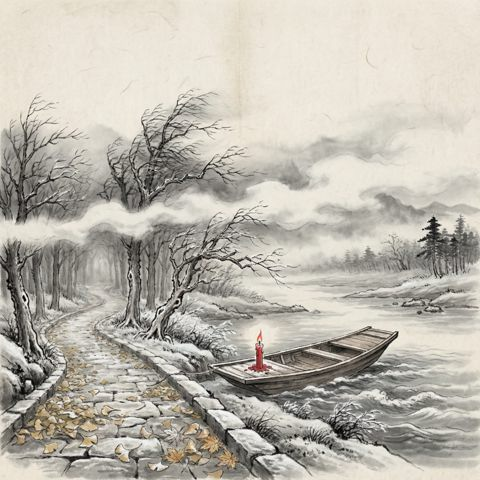 基图 0.341（已达标，两臂跳过循环）</td></tr></table>

## t16 · 雪寒鸦楼（自然·冬 · rich）

> **写一首冬景的七言绝句，要有飞雪和寒鸦**
>
> 雪意萧条欲破窗 / 寒鸦犹恋屋南楼 / 风流老将今何在 / 且向山前拾落蓬 —— 诗总分 0.827

CLIP raw：基图 **0.296** · F 轨迹 0.286 → 0.262 → 0.307 → 终值 **0.307** · L 轨迹 0.313 → 终值 **0.313**（决策 R）

<table>
<tr><td align="center">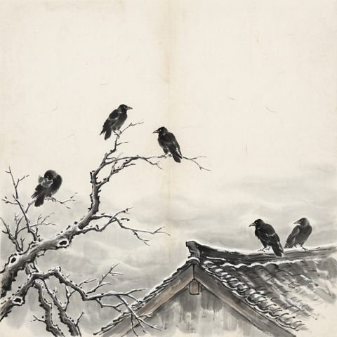 基图 0.296</td><td align="center">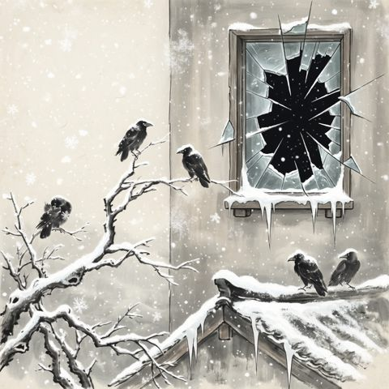 F r1 · 0.286</td><td align="center">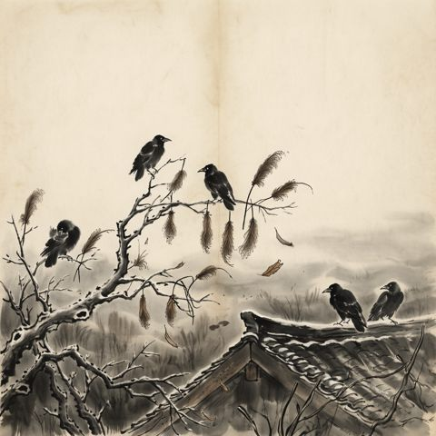 F r2 · 0.262</td><td align="center"> F r3 · 0.307</td><td align="center">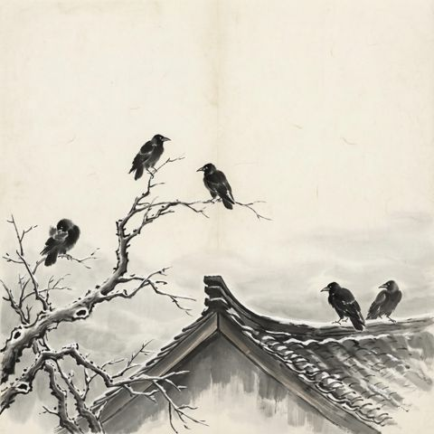 F 终图 · 0.307</td></tr>
<tr><td></td><td align="center">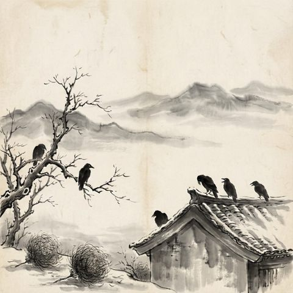 L r1(R) · 0.313</td><td align="center"> L 终图 · 0.313</td></tr>
</table>

## t17 · 高楼远眺（山水 · rich）

> **写一首山水的七言律诗，要有高楼和远山**
>
> 高阁凭栏倚泬寥 / 天容山色欲秋遥 / 白云似是江城月 / 落日浑如海上潮 / 水影空蒙寒照壁 / 山光摇动晚生桥 / 醉归不用金尊劝 / 更向高楼看远郊 —— 诗总分 0.850

CLIP raw：基图 **0.326** · F 轨迹 — → 终值 **0.326** · L 轨迹 — → 终值 **0.326**（决策 —）

<table><tr><td align="center"> 基图 0.326（已达标，两臂跳过循环）</td></tr></table>

## t18 · 归隐吟（田园 · sparse）

> **写一首五言律诗，主题是归隐**
>
> 不辞归隐久 / 何日复登科 / 自谓清无分 / 谁云白有歌 / 烟霞迷旧梦 / 松菊动新过 / 未得同车信 / 终当共草窠 —— 诗总分 0.887

CLIP raw：基图 **0.316** · F 轨迹 — → 终值 **0.316** · L 轨迹 — → 终值 **0.316**（决策 —）

<table><tr><td align="center">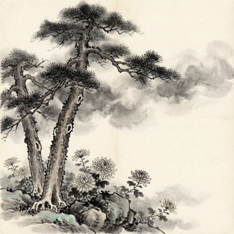 基图 0.316（已达标，两臂跳过循环）</td></tr></table>

## t19 · 征戍吟（边塞 · sparse）

> **写一首七言绝句，主题是征戍**
>
> 西塞山前风正急 / 乱鸦啼血上樯旗 / 不知谁作征人怨 / 吹笛东风送客悲 —— 诗总分 0.926

CLIP raw：基图 **0.338** · F 轨迹 — → 终值 **0.338** · L 轨迹 — → 终值 **0.338**（决策 —）

<table><tr><td align="center">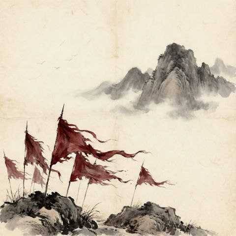 基图 0.338（已达标，两臂跳过循环）</td></tr></table>

## t20 · 客愁（羁旅 · sparse）

> **写一首七言律诗，主题是客愁**
>
> 寒雨连天夜未央 / 数峰清碧入青霄 / 月明船动湖光冷 / 风静潮生浦口遥 / 野店有花春意薄 / 客愁无寐酒痕销 / 梦回欲向江楼去 / 犹恐归舟误到桥 —— 诗总分 0.915

CLIP raw：基图 **0.294** · F 轨迹 0.305 → 终值 **0.305** · L 轨迹 0.318 → 终值 **0.318**（决策 R）

<table>
<tr><td align="center">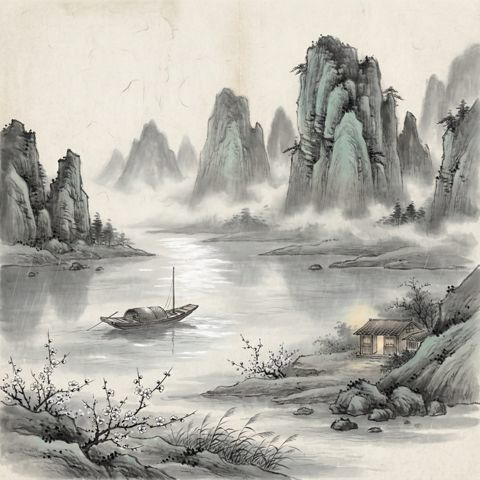 基图 0.294</td><td align="center"> F r1 · 0.305</td><td align="center"> F 终图 · 0.305</td></tr>
<tr><td></td><td align="center">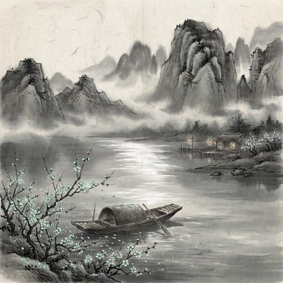 L r1(R) · 0.318</td><td align="center"> L 终图 · 0.318</td></tr>
</table>

## t21 · 长亭折柳（送别 · rich）

> **写一首送别的七言律诗，要有长亭和折柳**
>
> 客行无事即为游 / 更觉春光入酒楼 / 自是年华催白发 / 不关人事有清愁 / 长亭树下留连别 / 小苑花前醉舞休 / 明日青门陌头路 / 应悲杨柳又逢秋 —— 诗总分 0.867

CLIP raw：基图 **0.321** · F 轨迹 — → 终值 **0.321** · L 轨迹 — → 终值 **0.321**（决策 —）

<table><tr><td align="center">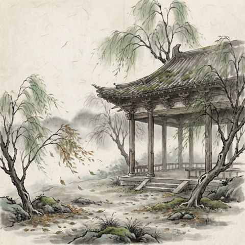 基图 0.321（已达标，两臂跳过循环）</td></tr></table>

## t22 · 吊古（怀古 · sparse）

> **写一首七言律诗，主题是吊古**
>
> 千载谁为作主人 / 至今遗像在城隅 / 空余白玉无香洁 / 未见青钱有雨珠 / 一节自惭犹可朽 / 几人曾许欲同枯 / 君看石上泉声咽 / 应恨前贤识未如 —— 诗总分 0.869

CLIP raw：基图 **0.328** · F 轨迹 — → 终值 **0.328** · L 轨迹 — → 终值 **0.328**（决策 —）

<table><tr><td align="center">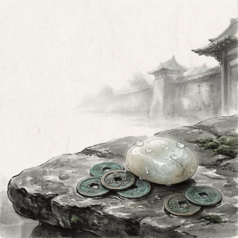 基图 0.328（已达标，两臂跳过循环）</td></tr></table>

## t23 · 重阳客思（节令 · sparse）

> **写一首五言律诗，主题是重阳**
>
> 客子重阳节 / 他乡事已谙 / 无端双鬓雪 / 有分一樽泉 / 秋草连天远 / 寒江入夜宽 / 遥知南陌上 / 犹望醉相欢 —— 诗总分 0.865

CLIP raw：基图 **0.321** · F 轨迹 — → 终值 **0.321** · L 轨迹 — → 终值 **0.321**（决策 —）

<table><tr><td align="center">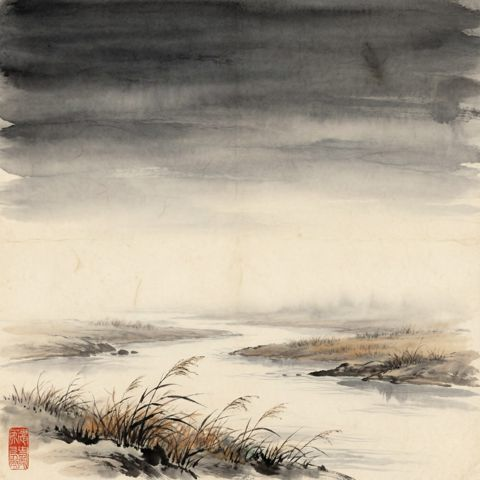 基图 0.321（已达标，两臂跳过循环）</td></tr></table>

## t24 · 无常悟（哲理 · sparse）

> **写一首五言绝句，主题是无常**
>
> 无为真乐处 / 但与众人同 / 欲识无常理 / 须教见苦空 —— 诗总分 0.879

CLIP raw：基图 **0.259** · F 轨迹 0.240 → 0.245 → 0.261 → 终值 **0.261** · L 轨迹 0.250 → 0.251 → 0.259 → 终值 **0.259**（决策 R E R）

<table>
<tr><td align="center"> 基图 0.259</td><td align="center">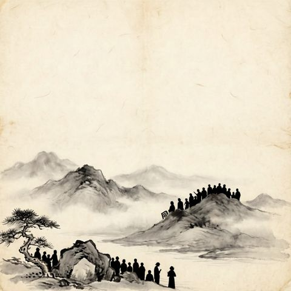 F r1 · 0.240</td><td align="center"> F r2 · 0.245</td><td align="center"> F r3 · 0.261</td><td align="center">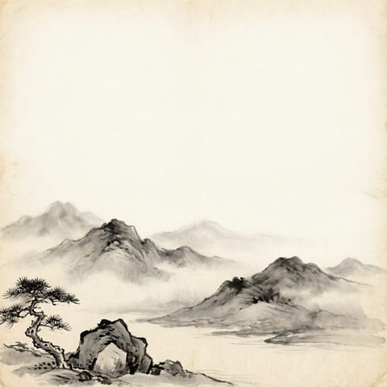 F 终图 · 0.261</td></tr>
<tr><td></td><td align="center">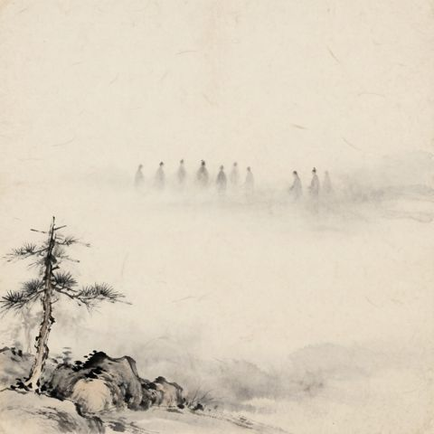 L r1(R) · 0.250</td><td align="center"> L r2(E) · 0.251</td><td align="center">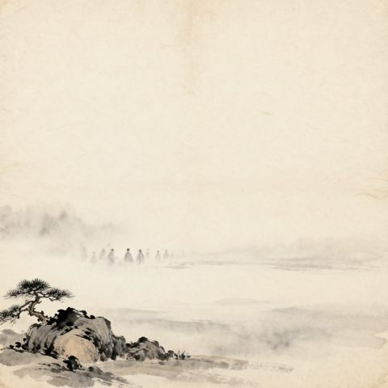 L r3(R) · 0.259</td><td align="center">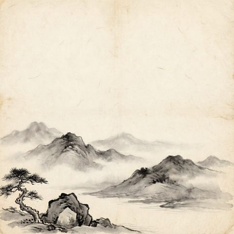 L 终图 · 0.259</td></tr>
</table>

## t25 · 春岸啼莺（自然·春 · rich）

> **写一首春景的五言律诗，要有桃花和啼莺**
>
> 野水桃花岸 / 春风草木芳 / 柳条经雨细 / 池面照云光 / 燕子窥人屋 / 莺声逐地桑 / 莫将新岁梦 / 愁杀白头郎 —— 诗总分 0.731

CLIP raw：基图 **0.306** · F 轨迹 — → 终值 **0.306** · L 轨迹 — → 终值 **0.306**（决策 —）

<table><tr><td align="center">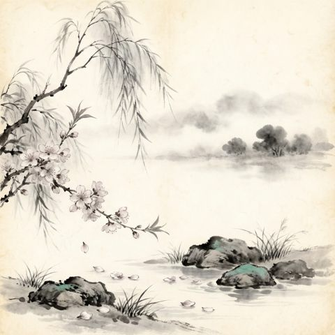 基图 0.306（已达标，两臂跳过循环）</td></tr></table>

## t26 · 雪夜独吟（自然·冬 · sparse）

> **写一首五言律诗，主题是雪夜**
>
> 雨作霜侵白 / 风飘雪欲空 / 天高人未识 / 月冷水如空 / 独对冰壶影 / 寒吟雪月功 / 故山无此味 / 时与梦魂通 —— 诗总分 0.891

CLIP raw：基图 **0.283** · F 轨迹 0.304 → 终值 **0.304** · L 轨迹 0.289 → 0.274 → 0.265 → 终值 **0.289**（决策 R R R）

<table>
<tr><td align="center">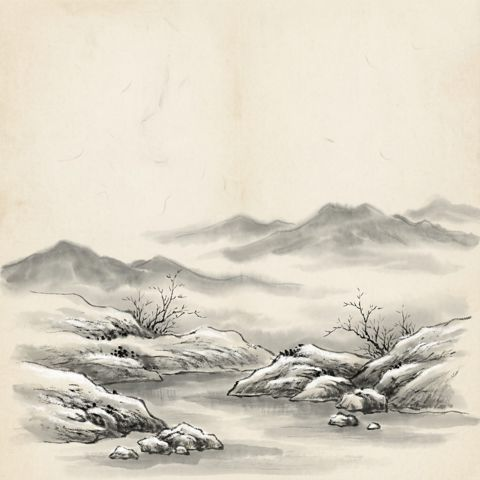 基图 0.283</td><td align="center"> F r1 · 0.304</td><td align="center"> F 终图 · 0.304</td></tr>
<tr><td></td><td align="center">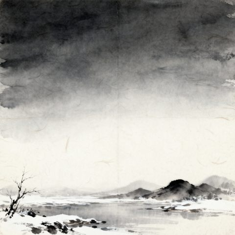 L r1(R) · 0.289</td><td align="center">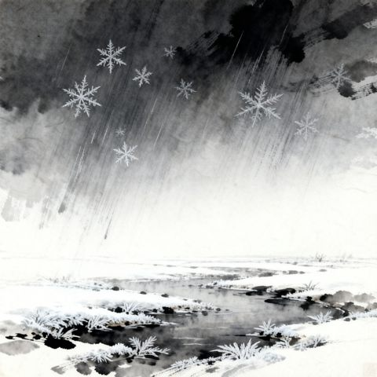 L r2(R) · 0.274</td><td align="center">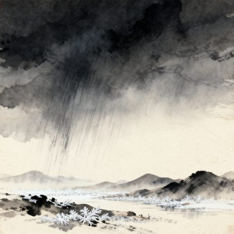 L r3(R) · 0.265</td><td align="center"> L 终图 · 0.289</td></tr>
</table>

## t27 · 冬夜炉火（自然·冬 · rich）

> **写一首冬景的七言律诗，要有炉火和寒灯**
>
> 冬深未觉有春回 / 日日闲吟对月开 / 风里炉烟销尽夜 / 雪中炉火照残梅 / 酒香犹带冰霜气 / 诗思偏于暖处来 / 一炷新烧黄栗酪 / 客窗无事得重陪 —— 诗总分 0.695

CLIP raw：基图 **0.356** · F 轨迹 — → 终值 **0.356** · L 轨迹 — → 终值 **0.356**（决策 —）

<table><tr><td align="center">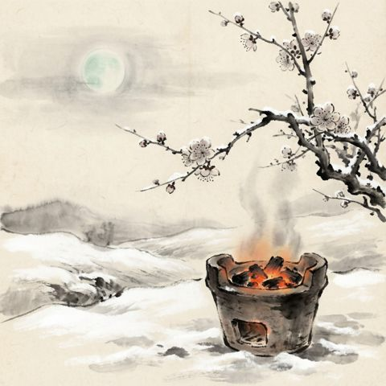 基图 0.356（已达标，两臂跳过循环）</td></tr></table>
